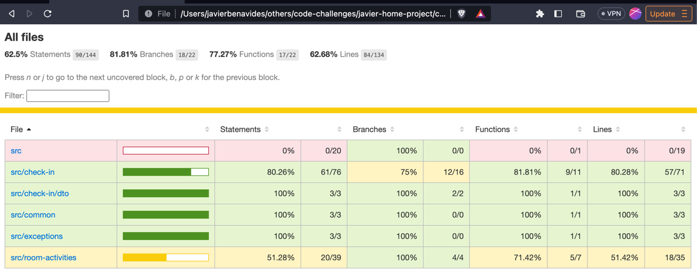
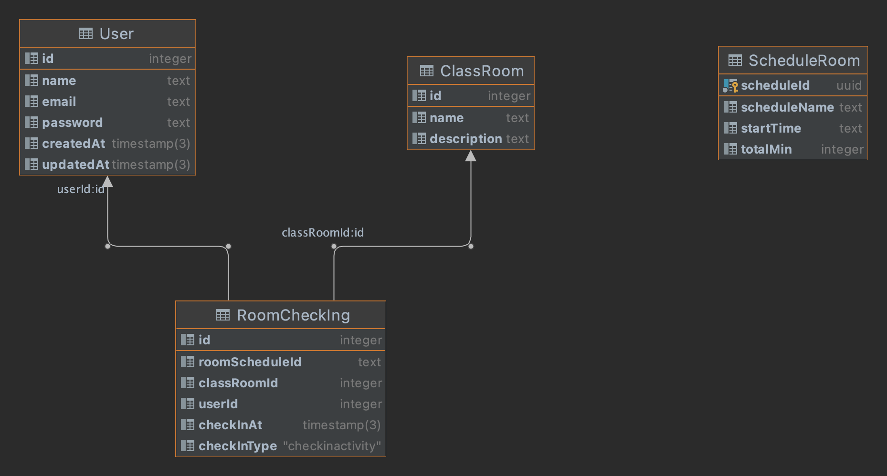
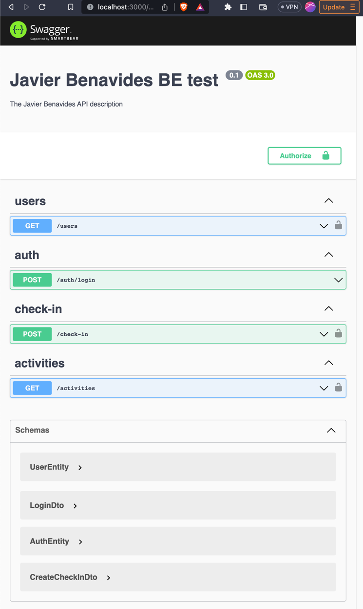

## Blog-Backend-REST-API-NestJS-Prisma 

A simple backend REST API for a blog built using NestJS, Prisma, PostgreSQL and Swagger. 

### Installation
0. Have installed Node.js(>= 16), npm and Typescript.
1. Install dependencies: `npm install`
2. Start a PostgreSQL database with docker using: `docker-compose up -d`. 
    - If you have a local instance of PostgreSQL running, you can skip this step. In this case, you will need to change the `DATABASE_URL` inside the `.env` file with a valid [PostgreSQL connection string](https://www.prisma.io/docs/concepts/database-connectors/postgresql#connection-details) for your database. 
3. Apply database migrations: `npm prisma:reset` 
4. Start the project:  `npm run start`
5. Access the project documentation http://localhost:3000/open-api


### Tests
Run `npm run test:cov`

Check the coverage in this html file : `coverage/lcov-report/index.html`



### Setup DB

Run `npm run prisma:reset`

#### Data Model:

The diagram shows a date model with four tables. However, it appears that two of these tables are not directly related to the check-in service and may have other purposes.

The "User" table is responsible for handling user authentication and generating JWT tokens for subsequent requests. It serves as an authorization service layer.

The "ScheduleRoom" table is used as a placeholder to retrieve schedule details, such as class information, for a specific room. This functionality could potentially be implemented in another service.

The "Classroom" table maintains an inventory of rooms where users can perform check-ins.

The "RoomChecking" table stores records of users who have checked in to a particular room and schedule (class).




### Data to Play with

Users :

| id | email | password |  
| :--- | :--- | :--- |  
| 1 | javier@upwork.com | zaq1@WSX |  
| 2 | john@upwork.com | zaq1@WSX |  
| 3 | jack@upwork.com | zaq1@WSX |


Rooms:

| id | name | description |
| :--- | :--- | :--- |
| 1000 | Lab room 1 | Lab room Linux env |
| 1001 | Lab room 2 | Lab room Win env |
| 1002 | Lab room 3 | Lab room Apple env |


Room Schedules:

| scheduleId | scheduleName | startTime | totalMin |
| :--- | :--- | :--- | :--- |
| bfedd044-381a-44f0-8c6d-ca9fb9aabf0b | Lab 1 Morning | 09:00 | 60 |
| 588ca14a-7482-4610-a816-ba3be58410f7 | Lab 2 Morning | 09:00 | 90 |
| 83ccd46c-3894-42c7-827c-484edef1022c | Lab 3 Morning | 09:00 | 90 |
| 2ade155c-a851-4574-9abe-2c1dd6d20878 | Lab 1 Noon | 12:00 | 90 |
| 6b5a55ab-6afc-461c-b984-a2cbfe5b260f | Lab 2 Noon | 12:00 | 90 |
| 3176c97b-b3b0-4008-b337-1456c5ff4761 | Lab 3 Noon | 12:00 | 90 |
| 3625ff92-f3d3-4916-9403-a449b1c829ef | Lab 1 Evening | 17:00 | 90 |
| e2c763e0-08e4-4b75-b720-09b11c65d0db | Lab 2 Evening | 17:00 | 90 |
| d4aa75cc-6d68-4592-82ae-34bad3e2f358 | Lab 3 Evening | 17:00 | 120 |


### Swagger Doc

http://localhost:3000/open-api





## Usage:

### Login

Users :

| id | email | password |  
| :--- | :--- | :--- |  
| 1 | javier@upwork.com | zaq1@WSX |  
| 2 | john@upwork.com | zaq1@WSX |  
| 3 | jack@upwork.com | zaq1@WSX |


```json
{
  "email": "string",
  "password": "string"
}
```

##### Consume Login endpoint:

```shell
curl -X 'POST' \
  'http://localhost:3000/auth/login' \
  -H 'accept: application/json' \
  -H 'Content-Type: application/json' \
  -d '{
  "email": "string",
  "password": "string"
}'

```

##### Get Room Activities endpoint:
http://localhost:3000/open-api#/activities/RoomActivitiesController_getCurrentActivities


Returns a list of activities given a room(roomId), room schedule(scheduleId) and date 

Query Parameters:
- date (optional date format yyyy-mm-dd): by default use the current date
- scheduleId (mandatory) : Id from the roomSchedule `bfedd044-381a-44f0-8c6d-ca9fb9aabf0b`
- roomId (mandatory): Id of the room to perform the check in `1000`

```shell
curl -X 'GET' \
  'http://localhost:3000/activities?checkInType=LATE&scheduleId=2ade155c-a851-4574-9abe-2c1dd6d20878&roomId=1000' \
  -H 'accept: */*' \
  -H 'Authorization: Bearer <<TOKEN FROM LOGIN RESPONSE>>'
}'

```

##### Add a user Checkin endpoint:
http://localhost:3000/open-api#/check-in/CheckInController_userCheckIn

```shell
curl -X 'POST' \
  'http://localhost:3000/check-in' \
  -H 'accept: */*' \
  -H 'Authorization: Bearer <<TOKEN FROM LOGIN RESPONSE>>'
  -H 'Content-Type: application/json' \
  -d '{
  "classRoomId": 0,
  "roomScheduleId": "string",
  "userId": 0
}'
```


Sample Request payload
```json
{
  "classRoomId": 1000,
  "roomScheduleId": "3625ff92-f3d3-4916-9403-a449b1c829ef",
  "userId": 1
}
```


# Functionalities

To perform a check-in, the user will scan a QR code using a device, and the scanned QR code will represent the RoomID. In the user interface, the user will have the option to select the schedule (scheduleId) for the Lab class XX, identified by the ID "3625ff92-f3d3-4916-9403-a449b1c829ef".

Alternatively, another option could be to provide multiple QR codes that contain both the roomId and scheduleId. This would simplify the check-in process for the user.


### Retrieve current activities for a given QR code (effectively, classroom ID)

Returns a list of activities given a room(roomId), room schedule(scheduleId) and date

Query Parameters:
- date (optional date format yyyy-mm-dd): by default use the current date
- scheduleId (mandatory) : Id from the roomSchedule `bfedd044-381a-44f0-8c6d-ca9fb9aabf0b`
- roomId (mandatory): Id of the room to perform the check in `1000`

http://localhost:3000/open-api#/activities/RoomActivitiesController_getCurrentActivities


### 'Check in' for a selected activity

In order to do a check-in, the endpoints need:
- valid RoomId
- valid ScheduleId
- userId

The check-in logic follows these scenarios:

- If a user arrives on time for a class (scheduleId) in a specific room (roomId) and checks in within the designated interval, the check-in record will be marked as "ON_TIME" activity.

- If a user checks in for a class (scheduleId) in a room (roomId) after the specified interval, the check-in record will be considered "LATE" activity.

- If a user attempts to check in twice for the same class (scheduleId) in a room (roomId), a "User has been checked-in previously" error with a status code of 422 will be returned.

- If a user tries to check in for a class (scheduleId) in a room (roomId) after the scheduled duration of the class, an error with the message "Can't check in, you're super late" and a status code of 422 will be returned.

- If the schedule service fails to provide schedule details for a given class (scheduleId) and room (roomId), a "Schedule details not found" error with a status code of 422 will be returned.

- If the user provided in the payload is different from the logged-in user (JWT), a "User is not allowed to perform this action" error with a status code of 422 will be returned.


## Considerations.

- What you are implementing for the check-in is effectively a 2-phase transaction (retrieve the eligible activity / perform the check-in). How would you ensure transactional integrity in this case (e.g. make sure that check-in is performed by the same person who made the retrieval, and the request is not forged)? Which technology standard would prevent tampering with the data?
  - In order to mitigate the risk of forgery, implementing a Cross-Site Request Forgery (CSRF) protection mechanism such as the one described in the OWASP CSRF prevention cheat sheet (https://owasp.org/www-community/attacks/csrf) can be beneficial. 
  
- Think how you would prevent QR code abuse (for ex. taking a picture of the QR code and using it outside the classroom)?
  - The service already validated the logged user it's the same to the one that came in the payload. 
  - To prevent check-ins from unauthorized locations, we can enhance the solution by incorporating geofence validation. This involves obtaining the device's location when scanning the QR code and performing a proximity check on the backend. By verifying that the device is in close proximity to the designated room, we can ensure that the check-in process proceeds securely. This combined approach of CSRF protection and geofence validation strengthens the overall security of the check-in system.
