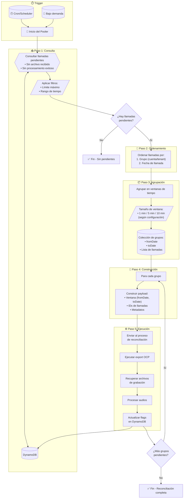
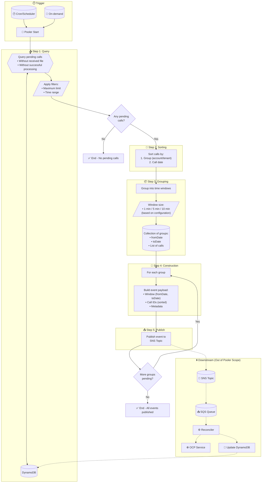

# Pooler de Reconciliación - Especificación Funcional

## Índice

1. [Resumen Ejecutivo](https://claude.ai/chat/552d76b7-e261-4624-833c-b094352f1595#1-resumen-ejecutivo)
2. [Contexto y Problema](https://claude.ai/chat/552d76b7-e261-4624-833c-b094352f1595#2-contexto-y-problema)
3. [Arquitectura General](https://claude.ai/chat/552d76b7-e261-4624-833c-b094352f1595#3-arquitectura-general)
4. [Modelo de Datos](https://claude.ai/chat/552d76b7-e261-4624-833c-b094352f1595#4-modelo-de-datos)
5. [Flujo de Procesamiento](https://claude.ai/chat/552d76b7-e261-4624-833c-b094352f1595#5-flujo-de-procesamiento)
6. [Detalle de Cada Paso](https://claude.ai/chat/552d76b7-e261-4624-833c-b094352f1595#6-detalle-de-cada-paso)
7. [Configuración del Sistema](https://claude.ai/chat/552d76b7-e261-4624-833c-b094352f1595#7-configuraci%C3%B3n-del-sistema)
8. [Manejo de Errores](https://claude.ai/chat/552d76b7-e261-4624-833c-b094352f1595#8-manejo-de-errores)
9. [Observabilidad y Métricas](https://claude.ai/chat/552d76b7-e261-4624-833c-b094352f1595#9-observabilidad-y-m%C3%A9tricas)
10. [Casos Borde y Consideraciones Especiales](https://claude.ai/chat/552d76b7-e261-4624-833c-b094352f1595#10-casos-borde-y-consideraciones-especiales)
11. [Seguridad](https://claude.ai/chat/552d76b7-e261-4624-833c-b094352f1595#11-seguridad)
12. [Escalabilidad](https://claude.ai/chat/552d76b7-e261-4624-833c-b094352f1595#12-escalabilidad)

---

## 1. Resumen Ejecutivo

### Objetivo

El **Pooler de Reconciliación** es un componente cuya responsabilidad es identificar llamadas cuyo archivo de grabación de voz aún no ha sido recibido o procesado exitosamente, agruparlas en ventanas de tiempo manejables y disparar su reprocesamiento a través del servicio de exportación de OCP.

### Alcance

|Aspecto|Descripción|
|---|---|
|**Entrada**|Registros de llamadas en DynamoDB con flags de estado|
|**Salida**|Payloads de reconciliación enviados al servicio de exportación OCP|
|**Frecuencia**|Periódica (cron) o bajo demanda|
|**Objetivo de negocio**|Garantizar que el 100% de las grabaciones sean eventualmente procesadas|

---

## 2. Contexto y Problema

### Problema que resuelve

En el flujo normal de procesamiento de llamadas, existen escenarios donde el archivo de grabación de voz no llega o no se procesa correctamente:

|Escenario|Causa típica|
|---|---|
|Archivo no recibido|Fallo de red, timeout en transferencia, error en OCP|
|Archivo recibido pero no procesado|Error en el procesador de audio, fallo de validación|
|Procesamiento parcial|Interrupción del servicio, error de almacenamiento|

### Necesidad del Pooler

Sin un mecanismo de reconciliación, estas llamadas quedarían en un estado "huérfano" indefinidamente. El pooler actúa como un mecanismo de **auto-sanación** del sistema.

### Integración con OCP

El servicio de exportación de OCP (Open Communication Platform) requiere consultas basadas en **rangos de tiempo**, no por llamadas individuales. Esto impone la necesidad de agrupar las llamadas pendientes en ventanas temporales antes de solicitar su reprocesamiento.

---

## 3. Arquitectura General

### Diagrama de Componentes

```
┌─────────────────────────────────────────────────────────────────────────┐
│                         POOLER DE RECONCILIACIÓN                        │
├─────────────────────────────────────────────────────────────────────────┤
│                                                                         │
│   ┌──────────┐    ┌──────────┐    ┌──────────┐    ┌──────────────────┐ │
│   │ Consulta │───▶│ Ordenar  │───▶│ Agrupar  │───▶│ Construir Payload│ │
│   │ DynamoDB │    │          │    │ Ventanas │    │                  │ │
│   └──────────┘    └──────────┘    └──────────┘    └────────┬─────────┘ │
│        ▲                                                    │          │
│        │                                                    ▼          │
│        │                                         ┌──────────────────┐  │
│        └─────────────────────────────────────────│  Reconciliador   │  │
│                     (actualiza flags)            └────────┬─────────┘  │
│                                                           │            │
└───────────────────────────────────────────────────────────┼────────────┘
                                                            │
                                                            ▼
                                                   ┌────────────────┐
                                                   │  Servicio OCP  │
                                                   │   (Externo)    │
                                                   └────────────────┘
```

### Componentes Involucrados

|Componente|Tipo|Responsabilidad|
|---|---|---|
|**Trigger**|EventBridge / Cron / API|Inicia la ejecución del pooler|
|**Pooler**|Lambda / ECS Task|Orquesta todo el proceso de reconciliación|
|**DynamoDB**|Base de datos|Almacena el estado de cada llamada|
|**Servicio OCP**|API Externa|Provee los archivos de grabación|
|**Reconciliador**|Lambda / Worker|Ejecuta el reprocesamiento real|

---

## 4. Modelo de Datos

### Estructura del Registro de Llamada en DynamoDB

Cada llamada almacenada en DynamoDB debe contener los siguientes atributos relevantes para la reconciliación:

#### Atributos de Identificación

|Atributo|Tipo|Descripción|Ejemplo|
|---|---|---|---|
|`callId`|String (PK)|Identificador único de la llamada|`"call-uuid-12345"`|
|`tenantId`|String (SK/GSI)|Identificador del tenant/cuenta|`"tenant-abc"`|
|`groupId`|String|Agrupación lógica (cuenta, cliente)|`"group-xyz"`|

#### Atributos Temporales

|Atributo|Tipo|Descripción|Ejemplo|
|---|---|---|---|
|`callTimestamp`|ISO 8601 String|Fecha y hora de la llamada|`"2024-01-15T10:30:00Z"`|
|`createdAt`|ISO 8601 String|Fecha de creación del registro|`"2024-01-15T10:31:00Z"`|
|`updatedAt`|ISO 8601 String|Última actualización|`"2024-01-15T10:35:00Z"`|

#### Flags de Estado (Críticos para Reconciliación)

|Atributo|Tipo|Valores|Descripción|
|---|---|---|---|
|`audioReceived`|Boolean|`true` / `false`|Indica si el archivo de audio fue recibido|
|`audioProcessed`|Boolean|`true` / `false`|Indica si el audio fue procesado exitosamente|
|`reconciliationStatus`|String|`pending` / `in_progress` / `completed` / `failed`|Estado del proceso de reconciliación|
|`reconciliationAttempts`|Number|0, 1, 2, ...|Número de intentos de reconciliación|
|`lastReconciliationAt`|ISO 8601 String|Fecha del último intento|`"2024-01-15T12:00:00Z"`|

#### Atributos de Metadata

|Atributo|Tipo|Descripción|
|---|---|---|
|`audioUrl`|String|URL del archivo de audio (si existe)|
|`duration`|Number|Duración de la llamada en segundos|
|`errorDetails`|Map|Detalles del último error (si aplica)|

### Índices Requeridos

Para que el pooler funcione eficientemente, se necesitan los siguientes índices:

#### GSI: ReconciliationIndex

|Partition Key|Sort Key|Proyección|
|---|---|---|
|`reconciliationStatus`|`callTimestamp`|ALL|

**Propósito**: Consultar eficientemente todas las llamadas pendientes de reconciliación ordenadas por fecha.

#### GSI: TenantCallsIndex

|Partition Key|Sort Key|Proyección|
|---|---|---|
|`tenantId`|`callTimestamp`|ALL|

**Propósito**: Consultar llamadas por tenant para agrupación.

---

## 5. Flujo de Procesamiento

### Diagrama de Flujo Completo



### Secuencia de Operaciones

```
Tiempo ──────────────────────────────────────────────────────────────▶

│ TRIGGER │    PASO 1    │  PASO 2  │   PASO 3   │ PASO 4 │   PASO 5   │
│         │              │          │            │        │            │
│  Cron   │   Query      │  Sort    │  Group     │ Build  │  Execute   │
│   or    │   DynamoDB   │  by      │  into      │ Pay-   │  Recon-    │
│  API    │   for        │  Group   │  Time      │ loads  │  ciliation │
│  Call   │   Pending    │  + Date  │  Windows   │        │            │
│         │              │          │            │        │            │
└─────────┴──────────────┴──────────┴────────────┴────────┴────────────┘
```

---

## 6. Detalle de Cada Paso

### Paso 1: Consulta de Llamadas Pendientes

#### Objetivo

Obtener de DynamoDB todas las llamadas que requieren reconciliación.

#### Criterios de Selección

Una llamada es candidata a reconciliación si cumple **cualquiera** de las siguientes condiciones:

|Condición|Lógica|
|---|---|
|Audio no recibido|`audioReceived = false`|
|Audio no procesado|`audioReceived = true AND audioProcessed = false`|
|Reconciliación fallida previa|`reconciliationStatus = 'failed' AND reconciliationAttempts < maxAttempts`|

#### Filtros Aplicables

|Filtro|Descripción|Valor por defecto|
|---|---|---|
|**Límite máximo**|Número máximo de llamadas a procesar en una ejecución|1000|
|**Rango de tiempo - Inicio**|No procesar llamadas más antiguas que X días|7 días|
|**Rango de tiempo - Fin**|No procesar llamadas más recientes que X minutos|5 minutos|
|**Excluir en progreso**|No incluir llamadas con `reconciliationStatus = 'in_progress'`|true|

#### Lógica del Rango de Tiempo

```
                    Ventana de Reconciliación
    ◄─────────────────────────────────────────────►
    
    │                                              │
    ▼                                              ▼
────┬──────────────────────────────────────────────┬─────────▶ tiempo
    │                                              │
 (now - 7d)                                    (now - 5min)
    
    Llamadas               Llamadas a              Llamadas
    muy antiguas           reconciliar             muy recientes
    (descartadas)                                  (esperando flujo normal)
```

**Razón del buffer de 5 minutos**: Las llamadas muy recientes aún pueden estar siendo procesadas por el flujo normal. Incluirlas causaría procesamiento duplicado.

#### Resultado del Paso 1

```
Lista<Llamada> llamadasPendientes = [
    { callId: "123", tenantId: "A", callTimestamp: "2024-01-15T10:00:00Z", ... },
    { callId: "456", tenantId: "A", callTimestamp: "2024-01-15T10:01:30Z", ... },
    { callId: "789", tenantId: "B", callTimestamp: "2024-01-15T09:55:00Z", ... },
    ...
]
```

---

### Paso 2: Ordenamiento de Resultados

#### Objetivo

Ordenar las llamadas para optimizar la agrupación posterior y el procesamiento en OCP.

#### Criterios de Ordenamiento

El ordenamiento se realiza en **dos niveles jerárquicos**:

|Nivel|Campo|Orden|Razón|
|---|---|---|---|
|**1º**|`groupId` (o `tenantId`)|Ascendente|Agrupa llamadas del mismo cliente/tenant|
|**2º**|`callTimestamp`|Ascendente|Facilita la creación de ventanas temporales consecutivas|

#### Ejemplo de Ordenamiento

**Antes del ordenamiento:**

```
callId: 789, tenantId: B, timestamp: 09:55:00
callId: 123, tenantId: A, timestamp: 10:00:00
callId: 456, tenantId: A, timestamp: 10:01:30
callId: 012, tenantId: B, timestamp: 10:05:00
```

**Después del ordenamiento:**

```
callId: 123, tenantId: A, timestamp: 10:00:00  ─┐
callId: 456, tenantId: A, timestamp: 10:01:30  ─┘ Grupo A

callId: 789, tenantId: B, timestamp: 09:55:00  ─┐
callId: 012, tenantId: B, timestamp: 10:05:00  ─┘ Grupo B
```

#### Importancia para OCP

El servicio de exportación de OCP funciona con parámetros `fromDate` y `toDate`. Al ordenar por grupo y luego por fecha:

1. Minimizamos el número de llamadas a OCP (una por grupo + ventana)
2. Cada ventana contiene llamadas relacionadas (mismo tenant)
3. Facilitamos el tracking y debugging

---

### Paso 3: Agrupación en Ventanas de Tiempo

#### Objetivo

Dividir las llamadas ordenadas en grupos pequeños basados en rangos de tiempo, respetando los límites de OCP.

#### Concepto de Ventana

Una **ventana de tiempo** es un rango `[fromDate, toDate]` que contiene todas las llamadas cuyo `callTimestamp` cae dentro de ese rango.

```
Ventana 1          Ventana 2          Ventana 3
[10:00 - 10:05]    [10:05 - 10:10]    [10:10 - 10:15]
     │                   │                  │
     ▼                   ▼                  ▼
  ┌─────┐            ┌─────┐            ┌─────┐
  │ 3   │            │ 5   │            │ 2   │  ← llamadas
  │calls│            │calls│            │calls│
  └─────┘            └─────┘            └─────┘
```

#### Tamaños de Ventana

|Tamaño|Uso recomendado|Consideraciones|
|---|---|---|
|**1 minuto**|Alta densidad de llamadas|Más llamadas a OCP, mayor granularidad|
|**5 minutos**|Densidad media (recomendado)|Balance entre eficiencia y granularidad|
|**10 minutos**|Baja densidad de llamadas|Menos llamadas a OCP, ventanas más grandes|

#### Algoritmo de Agrupación

1. **Inicializar** la primera ventana con el `callTimestamp` de la primera llamada
2. **Para cada llamada:**
    - Si `callTimestamp` está dentro de la ventana actual → agregar a la ventana
    - Si `callTimestamp` excede la ventana actual → cerrar ventana, crear nueva ventana
3. **Al cambiar de grupo/tenant:** cerrar ventana actual, crear nueva ventana

#### Selección Dinámica del Tamaño de Ventana

El tamaño de ventana puede calcularse dinámicamente según:

|Factor|Lógica|
|---|---|
|**Cantidad total de llamadas**|Si hay > 500 llamadas, usar ventanas más pequeñas (1 min)|
|**Límite de OCP**|Si OCP tiene límite de X llamadas por request, ajustar ventana|
|**Hora del día**|En horarios pico, usar ventanas más pequeñas|

**Fórmula sugerida:**

```
Si totalLlamadas > 500:
    tamañoVentana = 1 minuto
Si totalLlamadas > 100:
    tamañoVentana = 5 minutos
Si no:
    tamañoVentana = 10 minutos
```

#### Estructura de Salida

Cada grupo/ventana resultante contiene:

|Campo|Tipo|Descripción|
|---|---|---|
|`groupId`|String|Identificador del grupo (tenant)|
|`fromDate`|ISO 8601|Inicio de la ventana|
|`toDate`|ISO 8601|Fin de la ventana|
|`calls`|Array|Lista de llamadas en esta ventana|
|`callCount`|Number|Cantidad de llamadas en la ventana|

#### Ejemplo de Resultado

```
Grupos resultantes:
[
    {
        groupId: "tenant-A",
        fromDate: "2024-01-15T10:00:00Z",
        toDate: "2024-01-15T10:05:00Z",
        calls: [call-123, call-456, call-457],
        callCount: 3
    },
    {
        groupId: "tenant-A",
        fromDate: "2024-01-15T10:05:00Z",
        toDate: "2024-01-15T10:10:00Z",
        calls: [call-458, call-459],
        callCount: 2
    },
    {
        groupId: "tenant-B",
        fromDate: "2024-01-15T09:55:00Z",
        toDate: "2024-01-15T10:00:00Z",
        calls: [call-789],
        callCount: 1
    }
]
```

---

### Paso 4: Construcción del Payload de Reconciliación

#### Objetivo

Transformar cada grupo de ventana en un payload estructurado listo para enviar al reconciliador.

#### Estructura del Payload

```
ReconciliationPayload {
    // Identificación
    reconciliationId: String      // UUID único para tracking
    batchId: String               // ID del batch general (agrupa todos los payloads de esta ejecución)
    
    // Contexto
    groupId: String               // Tenant/cuenta
    windowIndex: Number           // Índice de esta ventana en el grupo
    totalWindows: Number          // Total de ventanas para este grupo
    
    // Ventana de tiempo
    fromDate: ISO 8601 String
    toDate: ISO 8601 String
    
    // Llamadas
    callIds: Array<String>        // Lista de IDs de llamadas a reconciliar
    callCount: Number
    
    // Metadata
    createdAt: ISO 8601 String    // Timestamp de creación del payload
    priority: String              // "high" | "normal" | "low"
    maxRetries: Number            // Reintentos permitidos para este payload
    
    // Configuración
    ocpEndpoint: String           // Endpoint de OCP a usar
    callbackUrl: String           // URL para notificar resultado (opcional)
}
```

#### Reglas de Construcción

|Campo|Regla de construcción|
|---|---|
|`reconciliationId`|Generar UUID v4 único|
|`batchId`|Mismo ID para todos los payloads de la misma ejecución del pooler|
|`priority`|Si `reconciliationAttempts > 2` → "high", si no → "normal"|
|`maxRetries`|`configMaxRetries - maxReconciliationAttempts` de las llamadas en el grupo|

#### Validaciones Pre-envío

Antes de enviar cada payload, validar:

|Validación|Acción si falla|
|---|---|
|`callIds` no está vacío|Descartar payload, loggear warning|
|`fromDate < toDate`|Corregir o descartar|
|Todas las llamadas pertenecen al mismo `groupId`|Separar en múltiples payloads|

---

### Paso 5: Ejecución del Proceso de Reconciliación

#### Objetivo

Procesar cada payload: llamar a OCP, obtener grabaciones, procesarlas y actualizar estado.

#### Sub-pasos de Ejecución

##### 5.1 Marcar llamadas como "en progreso"

Antes de iniciar el procesamiento:

|Acción|Campo|Valor|
|---|---|---|
|Actualizar en DynamoDB|`reconciliationStatus`|`"in_progress"`|
|Actualizar en DynamoDB|`lastReconciliationAt`|timestamp actual|
|Incrementar|`reconciliationAttempts`|+1|

**Propósito**: Evitar que otra ejecución del pooler tome las mismas llamadas.

##### 5.2 Llamar al servicio de exportación de OCP

|Parámetro|Valor|
|---|---|
|`fromDate`|`payload.fromDate`|
|`toDate`|`payload.toDate`|
|`tenantId`|`payload.groupId`|
|`format`|Configurado (ej: "wav", "mp3")|

**Respuesta esperada de OCP:**

```
{
    recordings: [
        { callId: "123", audioUrl: "https://...", duration: 120 },
        { callId: "456", audioUrl: "https://...", duration: 85 },
        ...
    ],
    notFound: ["789"],  // Llamadas sin grabación en OCP
    errors: []
}
```

##### 5.3 Recuperar archivos de grabación

Para cada `audioUrl` recibido:

1. Descargar el archivo de audio
2. Validar integridad (checksum si disponible)
3. Almacenar en el destino configurado (S3, filesystem, etc.)

##### 5.4 Procesar los audios

Ejecutar el pipeline de procesamiento de audio:

|Etapa|Descripción|
|---|---|
|Validación de formato|Verificar codec, sample rate, etc.|
|Transcripción|Si aplica, enviar a servicio de transcripción|
|Análisis|Si aplica, ejecutar análisis de sentimiento, etc.|
|Almacenamiento|Guardar resultados procesados|

##### 5.5 Actualizar flags en DynamoDB

**Caso: Procesamiento exitoso**

|Campo|Valor|
|---|---|
|`audioReceived`|`true`|
|`audioProcessed`|`true`|
|`reconciliationStatus`|`"completed"`|
|`audioUrl`|URL del audio almacenado|
|`updatedAt`|timestamp actual|

**Caso: Audio no encontrado en OCP**

|Campo|Valor|
|---|---|
|`reconciliationStatus`|`"failed"`|
|`errorDetails`|`{ code: "NOT_FOUND", message: "Audio not available in OCP" }`|

**Caso: Error en procesamiento**

|Campo|Valor|
|---|---|
|`reconciliationStatus`|`"failed"`|
|`errorDetails`|Detalles del error|

---

## 7. Configuración del Sistema

### Parámetros Configurables

#### Configuración de Consulta

|Parámetro|Tipo|Default|Descripción|
|---|---|---|---|
|`maxCallsPerExecution`|Number|1000|Límite de llamadas por ejecución|
|`lookbackDays`|Number|7|Días hacia atrás para buscar|
|`bufferMinutes`|Number|5|Minutos recientes a ignorar|
|`includeFailedReconciliations`|Boolean|true|Reintentar fallidas|
|`maxReconciliationAttempts`|Number|3|Máximo de reintentos por llamada|

#### Configuración de Ventanas

|Parámetro|Tipo|Default|Descripción|
|---|---|---|---|
|`defaultWindowSizeMinutes`|Number|5|Tamaño de ventana por defecto|
|`dynamicWindowSizing`|Boolean|true|Habilitar sizing dinámico|
|`minWindowSizeMinutes`|Number|1|Tamaño mínimo de ventana|
|`maxWindowSizeMinutes`|Number|15|Tamaño máximo de ventana|

#### Configuración de Ejecución

|Parámetro|Tipo|Default|Descripción|
|---|---|---|---|
|`parallelPayloads`|Number|5|Payloads a procesar en paralelo|
|`ocpTimeout`|Number|30000|Timeout para llamadas a OCP (ms)|
|`retryDelayMs`|Number|1000|Delay entre reintentos|
|`enableDryRun`|Boolean|false|Ejecutar sin procesar realmente|

#### Configuración del Scheduler

|Parámetro|Tipo|Default|Descripción|
|---|---|---|---|
|`cronExpression`|String|`"0 */15 * * * *"`|Cada 15 minutos|
|`enabled`|Boolean|true|Habilitar ejecución automática|
|`timezone`|String|`"UTC"`|Zona horaria del cron|

### Ejemplo de Configuración Completa

```yaml
reconciliationPooler:
  query:
    maxCallsPerExecution: 1000
    lookbackDays: 7
    bufferMinutes: 5
    includeFailedReconciliations: true
    maxReconciliationAttempts: 3
  
  windows:
    defaultWindowSizeMinutes: 5
    dynamicWindowSizing: true
    minWindowSizeMinutes: 1
    maxWindowSizeMinutes: 15
  
  execution:
    parallelPayloads: 5
    ocpTimeout: 30000
    retryDelayMs: 1000
    enableDryRun: false
  
  scheduler:
    cronExpression: "0 */15 * * * *"
    enabled: true
    timezone: "UTC"
  
  ocp:
    baseUrl: "https://ocp.example.com/api/v1"
    exportEndpoint: "/recordings/export"
    authType: "bearer"
```

---

## 8. Manejo de Errores

### Clasificación de Errores

|Tipo|Ejemplos|Acción|
|---|---|---|
|**Transitorios**|Timeout de red, OCP no disponible, throttling|Reintentar con backoff|
|**Permanentes**|Audio no existe en OCP, formato inválido|Marcar como fallido, no reintentar|
|**De configuración**|Credenciales inválidas, endpoint incorrecto|Alertar, detener ejecución|

### Estrategia de Reintentos

```
Intento 1: Inmediato
Intento 2: Esperar 1 segundo
Intento 3: Esperar 5 segundos
Intento 4: Esperar 30 segundos
Intento 5: Marcar como fallido definitivamente
```

### Manejo de Fallos Parciales

Cuando un payload contiene múltiples llamadas y algunas fallan:

|Escenario|Acción|
|---|---|
|100% éxito|Marcar todas como completadas|
|Fallo parcial|Marcar exitosas como completadas, fallidas como pendientes para siguiente ejecución|
|100% fallo|Reintentar todo el payload (si no excede intentos)|

### Circuit Breaker para OCP

Si OCP falla consistentemente:

|Condición|Acción|
|---|---|
|5 errores consecutivos|Abrir circuito, pausar 1 minuto|
|10 errores en 5 minutos|Abrir circuito, pausar 5 minutos|
|50% tasa de error en 10 minutos|Alertar, reducir paralelismo|

---

## 9. Observabilidad y Métricas

### Métricas a Capturar

#### Métricas de Volumen

|Métrica|Tipo|Descripción|
|---|---|---|
|`calls_pending_total`|Gauge|Llamadas pendientes de reconciliación|
|`calls_processed_total`|Counter|Llamadas procesadas (exitosas)|
|`calls_failed_total`|Counter|Llamadas con fallo de reconciliación|
|`payloads_sent_total`|Counter|Payloads enviados al reconciliador|

#### Métricas de Rendimiento

|Métrica|Tipo|Descripción|
|---|---|---|
|`execution_duration_seconds`|Histogram|Duración de cada ejecución del pooler|
|`ocp_latency_seconds`|Histogram|Latencia de llamadas a OCP|
|`processing_time_per_call_ms`|Histogram|Tiempo de procesamiento por llamada|

#### Métricas de Salud

|Métrica|Tipo|Descripción|
|---|---|---|
|`ocp_errors_total`|Counter|Errores de OCP por tipo|
|`circuit_breaker_state`|Gauge|Estado del circuit breaker (0=cerrado, 1=abierto)|
|`reconciliation_age_hours`|Histogram|Antigüedad de llamadas pendientes|

### Logs Estructurados

Cada ejecución debe loggear:

```json
{
  "level": "info",
  "event": "pooler_execution_completed",
  "batchId": "batch-uuid-123",
  "totalCallsFound": 150,
  "totalWindowsCreated": 12,
  "successfulCalls": 145,
  "failedCalls": 5,
  "durationMs": 45000,
  "timestamp": "2024-01-15T10:15:00Z"
}
```

### Alertas Recomendadas

|Alerta|Condición|Severidad|
|---|---|---|
|Alta acumulación|`calls_pending_total > 5000` por 1 hora|Warning|
|Fallo masivo|`calls_failed_total` incrementa > 100 en 15 min|Critical|
|OCP no disponible|`ocp_errors_total` > 10 en 5 min|Critical|
|Pooler no ejecuta|No hay ejecución en 30 minutos|Warning|

---

## 10. Casos Borde y Consideraciones Especiales

### Caso: Llamadas con timestamp futuro

**Situación**: Una llamada tiene `callTimestamp` en el futuro (error de reloj del sistema origen).

**Solución**:

- Filtrar llamadas con `callTimestamp > now` durante la consulta
- Loggear como anomalía para investigación
- No intentar reconciliar hasta que el timestamp sea válido

### Caso: Mismo callId en múltiples tenants

**Situación**: Por error de integración, el mismo `callId` existe para diferentes tenants.

**Solución**:

- La clave primaria debe ser compuesta: `tenantId#callId`
- Procesar como llamadas independientes
- Alertar sobre la duplicación para corrección en origen

### Caso: Ventana sin llamadas

**Situación**: Después de agrupar, una ventana queda vacía.

**Solución**:

- Descartar ventanas vacías antes del Paso 4
- No enviar payloads con `callIds` vacío

### Caso: OCP retorna más llamadas de las solicitadas

**Situación**: OCP retorna grabaciones que no estaban en nuestra lista de `callIds`.

**Solución**:

- Ignorar llamadas no solicitadas
- Loggear el exceso para análisis
- Solo procesar las llamadas que están en nuestro payload original

### Caso: Llamada reconciliada por flujo normal durante el proceso

**Situación**: Mientras el pooler procesa, el flujo normal completa la llamada.

**Solución**:

- Antes de actualizar a "completed", verificar estado actual
- Si ya está `audioProcessed = true`, no sobrescribir
- Usar actualización condicional en DynamoDB

### Caso: Ejecución del pooler interrumpida

**Situación**: Lambda timeout o fallo durante la ejecución.

**Solución**:

- Las llamadas marcadas como `in_progress` tendrán timeout configurable
- Siguiente ejecución: si `lastReconciliationAt > X minutos` y `status = in_progress` → resetear a `pending`

---

## 11. Seguridad

### Autenticación con OCP

|Método|Uso|
|---|---|
|API Key|Incluir en header `X-API-Key`|
|Bearer Token|Token JWT en header `Authorization`|
|mTLS|Certificado cliente para conexiones seguras|

### Protección de Datos

|Dato|Protección|
|---|---|
|Grabaciones de audio|Encriptar en tránsito (TLS) y reposo (AES-256)|
|URLs de audio|URLs pre-firmadas con expiración corta (15 min)|
|Logs|No loggear contenido de audio, solo metadatos|

### Permisos IAM (AWS)

```yaml
# Permisos mínimos requeridos
- dynamodb:Query
- dynamodb:UpdateItem
- dynamodb:GetItem
- s3:PutObject (para almacenar audios)
- s3:GetObject (para leer audios)
- logs:CreateLogGroup
- logs:CreateLogStream
- logs:PutLogEvents
```

---

## 12. Escalabilidad

### Estrategias de Escalado

#### Escalado Horizontal

|Componente|Estrategia|
|---|---|
|Pooler|Particionamiento por tenant (cada instancia maneja subset de tenants)|
|Reconciliador|Múltiples workers consumiendo de cola|
|DynamoDB|On-demand capacity o provisioned con auto-scaling|

#### Procesamiento en Paralelo

```
                          ┌─────────────┐
                       ┌─▶│ Worker 1    │
                       │  └─────────────┘
┌────────┐  ┌───────┐  │  ┌─────────────┐
│ Pooler │─▶│ Queue │──┼─▶│ Worker 2    │
└────────┘  └───────┘  │  └─────────────┘
                       │  ┌─────────────┐
                       └─▶│ Worker 3    │
                          └─────────────┘
```

### Límites y Throttling

|Recurso|Límite recomendado|Razón|
|---|---|---|
|Llamadas a OCP por minuto|100|Evitar throttling de OCP|
|Payloads en paralelo|5-10|Balance CPU/memoria|
|Llamadas por payload|100|Manejo de errores más granular|
|Ejecuciones simultáneas del pooler|1|Evitar procesamiento duplicado|

### Particionamiento por Tenant

Para sistemas con muchos tenants:

```
Pooler Instancia 1: Tenants A-M
Pooler Instancia 2: Tenants N-Z

Cada instancia consulta solo sus tenants asignados.
```

---

## Anexos

### A. Glosario

|Término|Definición|
|---|---|
|**Pooler**|Componente que consulta y agrupa llamadas pendientes|
|**Reconciliación**|Proceso de recuperar y procesar grabaciones faltantes|
|**OCP**|Open Communication Platform - sistema externo de grabaciones|
|**Ventana de tiempo**|Rango temporal para agrupar llamadas|
|**Payload**|Estructura de datos enviada al reconciliador|

### B. Checklist de Implementación

- [ ] Crear tabla DynamoDB con índices requeridos
- [ ] Configurar GSI para consultas de reconciliación
- [ ] Implementar lógica de consulta con filtros
- [ ] Implementar ordenamiento multi-nivel
- [ ] Implementar agrupación en ventanas
- [ ] Implementar construcción de payloads
- [ ] Integrar con servicio OCP
- [ ] Implementar actualización de flags
- [ ] Configurar scheduler (EventBridge/CloudWatch)
- [ ] Implementar métricas y logging
- [ ] Configurar alertas
- [ ] Pruebas de carga
- [ ] Documentar runbook operacional

### C. Referencias

- Documentación de API de OCP
- Guía de mejores prácticas de DynamoDB
- Patrones de integración empresarial

---

_Documento generado para especificación funcional. Versión 1.0_
# Reconciliation Pooler - Functional Specification

## Table of Contents

1. [Executive Summary](https://claude.ai/chat/552d76b7-e261-4624-833c-b094352f1595#1-executive-summary)
2. [Context and Problem](https://claude.ai/chat/552d76b7-e261-4624-833c-b094352f1595#2-context-and-problem)
3. [General Architecture](https://claude.ai/chat/552d76b7-e261-4624-833c-b094352f1595#3-general-architecture)
4. [Data Model](https://claude.ai/chat/552d76b7-e261-4624-833c-b094352f1595#4-data-model)
5. [Processing Flow](https://claude.ai/chat/552d76b7-e261-4624-833c-b094352f1595#5-processing-flow)
6. [Detailed Steps](https://claude.ai/chat/552d76b7-e261-4624-833c-b094352f1595#6-detailed-steps)
7. [System Configuration](https://claude.ai/chat/552d76b7-e261-4624-833c-b094352f1595#7-system-configuration)
8. [Error Handling](https://claude.ai/chat/552d76b7-e261-4624-833c-b094352f1595#8-error-handling)
9. [Observability and Metrics](https://claude.ai/chat/552d76b7-e261-4624-833c-b094352f1595#9-observability-and-metrics)
10. [Edge Cases and Special Considerations](https://claude.ai/chat/552d76b7-e261-4624-833c-b094352f1595#10-edge-cases-and-special-considerations)
11. [Security](https://claude.ai/chat/552d76b7-e261-4624-833c-b094352f1595#11-security)
12. [Scalability](https://claude.ai/chat/552d76b7-e261-4624-833c-b094352f1595#12-scalability)

---

## 1. Executive Summary

### Objective

The **Reconciliation Pooler** is a component responsible for identifying calls whose voice recording file has not yet been received or successfully processed, grouping them into manageable time windows, and publishing reconciliation events to an SNS topic for downstream processing.

### Scope

|Aspect|Description|
|---|---|
|**Input**|Call records in DynamoDB with status flags|
|**Output**|Reconciliation events published to SNS topic|
|**Frequency**|Periodic (cron) or on-demand|
|**Business Goal**|Ensure 100% of recordings are eventually processed|

### Key Design Decisions

|Decision|Rationale|
|---|---|
|**SNS as output**|Decouples pooler from reconciliation execution, enables fan-out|
|**Time windows**|OCP export service requires date ranges, not individual calls|
|**Sorted calls in events**|Optimizes downstream processing by tenant and time|

---

## 2. Context and Problem

### Problem Being Solved

In the normal call processing flow, there are scenarios where the voice recording file does not arrive or is not processed correctly:

|Scenario|Typical Cause|
|---|---|
|File not received|Network failure, transfer timeout, OCP error|
|File received but not processed|Audio processor error, validation failure|
|Partial processing|Service interruption, storage error|

### Need for the Pooler

Without a reconciliation mechanism, these calls would remain in an "orphan" state indefinitely. The pooler acts as a **self-healing** mechanism for the system.

### Integration with OCP

The OCP (Open Communication Platform) export service requires queries based on **time ranges**, not individual calls. This imposes the need to group pending calls into time windows before requesting their reprocessing.

---

## 3. General Architecture

### Component Diagram

```
┌─────────────────────────────────────────────────────────────────────────┐
│                         RECONCILIATION POOLER                           │
├─────────────────────────────────────────────────────────────────────────┤
│                                                                         │
│   ┌──────────┐    ┌──────────┐    ┌──────────┐    ┌──────────────────┐ │
│   │  Query   │───▶│  Sort    │───▶│  Group   │───▶│  Build Payload   │ │
│   │ DynamoDB │    │          │    │ Windows  │    │                  │ │
│   └──────────┘    └──────────┘    └──────────┘    └────────┬─────────┘ │
│                                                             │          │
│                                                             ▼          │
│                                                  ┌──────────────────┐  │
│                                                  │ Publish to SNS   │  │
│                                                  └────────┬─────────┘  │
│                                                           │            │
└───────────────────────────────────────────────────────────┼────────────┘
                                                            │
                                                            ▼
                                                   ┌────────────────┐
                                                   │   SNS Topic    │
                                                   │ (Reconciliation│
                                                   │    Events)     │
                                                   └───────┬────────┘
                                                           │
                          ┌────────────────────────────────┼────────────────────────────────┐
                          │                                │                                │
                          ▼                                ▼                                ▼
                 ┌────────────────┐              ┌────────────────┐              ┌────────────────┐
                 │  SQS Queue 1   │              │  SQS Queue 2   │              │   Other        │
                 │  (Reconciler)  │              │  (Analytics)   │              │  Subscribers   │
                 └───────┬────────┘              └────────────────┘              └────────────────┘
                         │
                         ▼
                 ┌────────────────┐
                 │  Reconciler    │
                 │  (Lambda/ECS)  │
                 └───────┬────────┘
                         │
            ┌────────────┴────────────┐
            │                         │
            ▼                         ▼
   ┌────────────────┐        ┌────────────────┐
   │  OCP Service   │        │   DynamoDB     │
   │   (External)   │        │ (Update Flags) │
   └────────────────┘        └────────────────┘
```

### Components Involved

|Component|Type|Responsibility|
|---|---|---|
|**Trigger**|EventBridge / Cron / API|Initiates pooler execution|
|**Pooler**|Lambda / ECS Task|Queries, sorts, groups calls and publishes events to SNS|
|**SNS Topic**|AWS SNS|Receives reconciliation events and fans out to subscribers|
|**SQS Queue**|AWS SQS|Buffers events for the reconciler (decoupling)|
|**DynamoDB**|Database|Stores the state of each call|
|**OCP Service**|External API|Provides recording files|
|**Reconciler**|Lambda / Worker|Consumes events from SQS and executes reprocessing|

---

## 4. Data Model

### Call Record Structure in DynamoDB

Each call stored in DynamoDB must contain the following attributes relevant to reconciliation:

#### Identification Attributes

|Attribute|Type|Description|Example|
|---|---|---|---|
|`callId`|String (PK)|Unique call identifier|`"call-uuid-12345"`|
|`tenantId`|String (SK/GSI)|Tenant/account identifier|`"tenant-abc"`|
|`groupId`|String|Logical grouping (account, client)|`"group-xyz"`|

#### Temporal Attributes

|Attribute|Type|Description|Example|
|---|---|---|---|
|`callTimestamp`|ISO 8601 String|Call date and time|`"2024-01-15T10:30:00Z"`|
|`createdAt`|ISO 8601 String|Record creation date|`"2024-01-15T10:31:00Z"`|
|`updatedAt`|ISO 8601 String|Last update|`"2024-01-15T10:35:00Z"`|

#### Status Flags (Critical for Reconciliation)

|Attribute|Type|Values|Description|
|---|---|---|---|
|`audioReceived`|Boolean|`true` / `false`|Indicates if the audio file was received|
|`audioProcessed`|Boolean|`true` / `false`|Indicates if the audio was successfully processed|
|`reconciliationStatus`|String|`pending` / `in_progress` / `completed` / `failed`|Reconciliation process status|
|`reconciliationAttempts`|Number|0, 1, 2, ...|Number of reconciliation attempts|
|`lastReconciliationAt`|ISO 8601 String|Date of last attempt|`"2024-01-15T12:00:00Z"`|

#### Metadata Attributes

|Attribute|Type|Description|
|---|---|---|
|`audioUrl`|String|Audio file URL (if exists)|
|`duration`|Number|Call duration in seconds|
|`errorDetails`|Map|Last error details (if applicable)|

### Required Indexes

For the pooler to work efficiently, the following indexes are needed:

#### GSI: ReconciliationIndex

|Partition Key|Sort Key|Projection|
|---|---|---|
|`reconciliationStatus`|`callTimestamp`|ALL|

**Purpose**: Efficiently query all calls pending reconciliation sorted by date.

#### GSI: TenantCallsIndex

|Partition Key|Sort Key|Projection|
|---|---|---|
|`tenantId`|`callTimestamp`|ALL|

**Purpose**: Query calls by tenant for grouping.

---

## 5. Processing Flow

### Complete Flow Diagram



### Operations Sequence

```
Time ──────────────────────────────────────────────────────────────▶

│ TRIGGER │    STEP 1    │  STEP 2  │   STEP 3   │ STEP 4 │  STEP 5  │
│         │              │          │            │        │          │
│  Cron   │   Query      │  Sort    │  Group     │ Build  │ Publish  │
│   or    │   DynamoDB   │  by      │  into      │ Event  │ to SNS   │
│  API    │   for        │  Group   │  Time      │ Pay-   │ Topic    │
│  Call   │   Pending    │  + Date  │  Windows   │ loads  │          │
│         │              │          │            │        │          │
└─────────┴──────────────┴──────────┴────────────┴────────┴──────────┘
                                                                │
                                                                ▼
                                                    ┌───────────────────┐
                                                    │ POOLER ENDS HERE  │
                                                    └───────────────────┘
                                                                │
                                                                ▼
                          ┌─────────────────────────────────────────────────────┐
                          │              DOWNSTREAM PROCESSING                  │
                          │  SNS → SQS → Reconciler → OCP → Update DynamoDB    │
                          └─────────────────────────────────────────────────────┘
```

---

## 6. Detailed Steps

### Step 1: Query Pending Calls

#### Objective

Retrieve from DynamoDB all calls that require reconciliation.

#### Selection Criteria

A call is a reconciliation candidate if it meets **any** of the following conditions:

|Condition|Logic|
|---|---|
|Audio not received|`audioReceived = false`|
|Audio not processed|`audioReceived = true AND audioProcessed = false`|
|Previous failed reconciliation|`reconciliationStatus = 'failed' AND reconciliationAttempts < maxAttempts`|

#### Applicable Filters

|Filter|Description|Default Value|
|---|---|---|
|**Maximum limit**|Maximum number of calls to process per execution|1000|
|**Time range - Start**|Do not process calls older than X days|7 days|
|**Time range - End**|Do not process calls more recent than X minutes|5 minutes|
|**Exclude in progress**|Do not include calls with `reconciliationStatus = 'in_progress'`|true|

#### Time Range Logic

```
                    Reconciliation Window
    ◄─────────────────────────────────────────────►
    
    │                                              │
    ▼                                              ▼
────┬──────────────────────────────────────────────┬─────────▶ time
    │                                              │
 (now - 7d)                                    (now - 5min)
    
    Very old               Calls to              Very recent
    calls                  reconcile             calls
    (discarded)                                  (waiting for normal flow)
```

**Reason for 5-minute buffer**: Very recent calls may still be processed by the normal flow. Including them would cause duplicate processing.

#### Step 1 Result

```
List<Call> pendingCalls = [
    { callId: "123", tenantId: "A", callTimestamp: "2024-01-15T10:00:00Z", ... },
    { callId: "456", tenantId: "A", callTimestamp: "2024-01-15T10:01:30Z", ... },
    { callId: "789", tenantId: "B", callTimestamp: "2024-01-15T09:55:00Z", ... },
    ...
]
```

---

### Step 2: Sort Results

#### Objective

Sort calls to optimize subsequent grouping and processing in OCP.

#### Sorting Criteria

Sorting is performed in **two hierarchical levels**:

|Level|Field|Order|Reason|
|---|---|---|---|
|**1st**|`groupId` (or `tenantId`)|Ascending|Groups calls from the same client/tenant|
|**2nd**|`callTimestamp`|Ascending|Facilitates creating consecutive time windows|

#### Sorting Example

**Before sorting:**

```
callId: 789, tenantId: B, timestamp: 09:55:00
callId: 123, tenantId: A, timestamp: 10:00:00
callId: 456, tenantId: A, timestamp: 10:01:30
callId: 012, tenantId: B, timestamp: 10:05:00
```

**After sorting:**

```
callId: 123, tenantId: A, timestamp: 10:00:00  ─┐
callId: 456, tenantId: A, timestamp: 10:01:30  ─┘ Group A

callId: 789, tenantId: B, timestamp: 09:55:00  ─┐
callId: 012, tenantId: B, timestamp: 10:05:00  ─┘ Group B
```

#### Importance for OCP

The OCP export service works with `fromDate` and `toDate` parameters. By sorting by group and then by date:

1. We minimize the number of calls to OCP (one per group + window)
2. Each window contains related calls (same tenant)
3. We facilitate tracking and debugging

---

### Step 3: Group into Time Windows

#### Objective

Divide sorted calls into small groups based on time ranges, respecting OCP limits.

#### Window Concept

A **time window** is a range `[fromDate, toDate]` containing all calls whose `callTimestamp` falls within that range.

```
Window 1           Window 2           Window 3
[10:00 - 10:05]    [10:05 - 10:10]    [10:10 - 10:15]
     │                   │                  │
     ▼                   ▼                  ▼
  ┌─────┐            ┌─────┐            ┌─────┐
  │ 3   │            │ 5   │            │ 2   │  ← calls
  │calls│            │calls│            │calls│
  └─────┘            └─────┘            └─────┘
```

#### Window Sizes

|Size|Recommended Use|Considerations|
|---|---|---|
|**1 minute**|High call density|More calls to OCP, higher granularity|
|**5 minutes**|Medium density (recommended)|Balance between efficiency and granularity|
|**10 minutes**|Low call density|Fewer calls to OCP, larger windows|

#### Grouping Algorithm

1. **Initialize** the first window with the `callTimestamp` of the first call
2. **For each call:**
    - If `callTimestamp` is within the current window → add to window
    - If `callTimestamp` exceeds the current window → close window, create new window
3. **When changing group/tenant:** close current window, create new window

#### Dynamic Window Size Selection

Window size can be calculated dynamically based on:

|Factor|Logic|
|---|---|
|**Total call count**|If > 500 calls, use smaller windows (1 min)|
|**OCP limit**|If OCP has a limit of X calls per request, adjust window|
|**Time of day**|During peak hours, use smaller windows|

**Suggested formula:**

```
If totalCalls > 500:
    windowSize = 1 minute
If totalCalls > 100:
    windowSize = 5 minutes
Otherwise:
    windowSize = 10 minutes
```

#### Output Structure

Each resulting group/window contains:

|Field|Type|Description|
|---|---|---|
|`groupId`|String|Group identifier (tenant)|
|`fromDate`|ISO 8601|Window start|
|`toDate`|ISO 8601|Window end|
|`calls`|Array|List of calls in this window|
|`callCount`|Number|Number of calls in the window|

#### Result Example

```
Resulting groups:
[
    {
        groupId: "tenant-A",
        fromDate: "2024-01-15T10:00:00Z",
        toDate: "2024-01-15T10:05:00Z",
        calls: [call-123, call-456, call-457],
        callCount: 3
    },
    {
        groupId: "tenant-A",
        fromDate: "2024-01-15T10:05:00Z",
        toDate: "2024-01-15T10:10:00Z",
        calls: [call-458, call-459],
        callCount: 2
    },
    {
        groupId: "tenant-B",
        fromDate: "2024-01-15T09:55:00Z",
        toDate: "2024-01-15T10:00:00Z",
        calls: [call-789],
        callCount: 1
    }
]
```

---

### Step 4: Build Reconciliation Payload

#### Objective

Transform each window group into a structured payload ready to send to the reconciler.

#### Payload Structure

```
ReconciliationPayload {
    // Identification
    reconciliationId: String      // Unique UUID for tracking
    batchId: String               // General batch ID (groups all payloads from this execution)
    
    // Context
    groupId: String               // Tenant/account
    windowIndex: Number           // Index of this window in the group
    totalWindows: Number          // Total windows for this group
    
    // Time window
    fromDate: ISO 8601 String
    toDate: ISO 8601 String
    
    // Calls
    callIds: Array<String>        // List of call IDs to reconcile
    callCount: Number
    
    // Metadata
    createdAt: ISO 8601 String    // Payload creation timestamp
    priority: String              // "high" | "normal" | "low"
    maxRetries: Number            // Allowed retries for this payload
    
    // Configuration
    ocpEndpoint: String           // OCP endpoint to use
    callbackUrl: String           // URL to notify result (optional)
}
```

#### Construction Rules

|Field|Construction Rule|
|---|---|
|`reconciliationId`|Generate unique UUID v4|
|`batchId`|Same ID for all payloads from the same pooler execution|
|`priority`|If `reconciliationAttempts > 2` → "high", otherwise → "normal"|
|`maxRetries`|`configMaxRetries - maxReconciliationAttempts` of calls in the group|

#### Pre-send Validations

Before sending each payload, validate:

|Validation|Action if Failed|
|---|---|
|`callIds` is not empty|Discard payload, log warning|
|`fromDate < toDate`|Correct or discard|
|All calls belong to the same `groupId`|Separate into multiple payloads|

---

### Step 5: Publish Events to SNS Topic

#### Objective

Publish each reconciliation payload as an event to the SNS topic, enabling downstream consumers to process the calls asynchronously.

#### SNS Topic Configuration

|Property|Value|Description|
|---|---|---|
|Topic Name|`reconciliation-events`|Main topic for reconciliation events|
|Type|Standard|Allows high throughput (FIFO not required)|
|Encryption|SSE enabled|Server-side encryption with KMS|
|Access Policy|Restricted|Only pooler can publish, only authorized subscribers can consume|

#### SNS Event Structure

Each message published to SNS contains:

```json
{
  "eventType": "RECONCILIATION_REQUEST",
  "eventId": "evt-uuid-12345",
  "timestamp": "2024-01-15T10:15:00Z",
  "source": "reconciliation-pooler",
  "version": "1.0",
  
  "payload": {
    "reconciliationId": "rec-uuid-67890",
    "batchId": "batch-uuid-111",
    
    "groupId": "tenant-abc",
    "windowIndex": 1,
    "totalWindows": 5,
    
    "fromDate": "2024-01-15T10:00:00Z",
    "toDate": "2024-01-15T10:05:00Z",
    
    "calls": [
      {
        "callId": "call-123",
        "callTimestamp": "2024-01-15T10:01:00Z",
        "reconciliationAttempts": 0
      },
      {
        "callId": "call-456",
        "callTimestamp": "2024-01-15T10:03:30Z",
        "reconciliationAttempts": 1
      }
    ],
    "callCount": 2,
    
    "priority": "normal",
    "maxRetries": 3,
    
    "metadata": {
      "ocpEndpoint": "https://ocp.example.com/api/v1",
      "audioFormat": "wav"
    }
  }
}
```

#### Event Attributes (SNS Message Attributes)

Message attributes enable filtering at the subscription level:

|Attribute|Type|Example|Purpose|
|---|---|---|---|
|`eventType`|String|`RECONCILIATION_REQUEST`|Filter by event type|
|`groupId`|String|`tenant-abc`|Route by tenant|
|`priority`|String|`high` / `normal` / `low`|Priority-based routing|
|`callCount`|Number|`15`|Filter by batch size|
|`batchId`|String|`batch-uuid-111`|Correlation tracking|

#### Publishing Logic

##### 5.1 Validate payload before publishing

|Validation|Action if Failed|
|---|---|
|`calls` array is not empty|Skip this window, log warning|
|`fromDate < toDate`|Correct or skip|
|All required fields present|Fail with error|

##### 5.2 Mark calls as "pending reconciliation"

Before publishing, optionally update call status in DynamoDB:

|Field|Value|
|---|---|
|`reconciliationStatus`|`"queued"`|
|`lastReconciliationAt`|current timestamp|

**Note**: This step is optional. Some implementations prefer to update status only when the reconciler picks up the event.

##### 5.3 Publish to SNS

```
For each payload:
    1. Serialize payload to JSON
    2. Set message attributes
    3. Publish to SNS topic
    4. Log success with messageId
    5. Continue to next payload
```

##### 5.4 Handle publishing failures

|Failure Type|Action|
|---|---|
|Transient (throttling, timeout)|Retry with exponential backoff (max 3 attempts)|
|Permanent (invalid payload)|Log error, skip payload, continue|
|Topic not found|Abort execution, alert|

#### Downstream Processing (Out of Pooler Scope)

Once published to SNS, the event flows to downstream consumers:

```
SNS Topic
    │
    ├──▶ SQS Queue (Reconciler) ──▶ Reconciler Lambda/Worker
    │                                    │
    │                                    ├──▶ Call OCP export
    │                                    ├──▶ Download recordings
    │                                    ├──▶ Process audio
    │                                    └──▶ Update DynamoDB flags
    │
    ├──▶ SQS Queue (Analytics) ──▶ Analytics Service
    │
    └──▶ CloudWatch Logs (Audit)
```

#### Benefits of SNS Decoupling

|Benefit|Description|
|---|---|
|**Loose coupling**|Pooler doesn't need to know about reconciler implementation|
|**Scalability**|Multiple reconciler instances can consume in parallel|
|**Resilience**|If reconciler is down, events are buffered in SQS|
|**Flexibility**|Easy to add new subscribers (analytics, audit, etc.)|
|**Retry handling**|SQS handles retries and dead-letter queues|

---

## 6. Downstream Processing (Reference)

> **Note**: This section describes what happens after the pooler publishes events. This processing is handled by the **Reconciler** component, not the Pooler.

### Reconciler Responsibilities

The Reconciler consumes events from SQS and:

1. **Marks calls as "in progress"** in DynamoDB
2. **Calls OCP export service** with the time window
3. **Downloads recording files** from returned URLs
4. **Processes audio files** (validation, transcription, etc.)
5. **Updates flags** in DynamoDB (`audioReceived`, `audioProcessed`, `reconciliationStatus`)
6. **Handles failures** with retry logic and dead-letter queue

---

## 7. System Configuration

### Configurable Parameters

#### Query Configuration

|Parameter|Type|Default|Description|
|---|---|---|---|
|`maxCallsPerExecution`|Number|1000|Call limit per execution|
|`lookbackDays`|Number|7|Days to look back|
|`bufferMinutes`|Number|5|Recent minutes to ignore|
|`includeFailedReconciliations`|Boolean|true|Retry failed ones|
|`maxReconciliationAttempts`|Number|3|Maximum retries per call|

#### Window Configuration

|Parameter|Type|Default|Description|
|---|---|---|---|
|`defaultWindowSizeMinutes`|Number|5|Default window size|
|`dynamicWindowSizing`|Boolean|true|Enable dynamic sizing|
|`minWindowSizeMinutes`|Number|1|Minimum window size|
|`maxWindowSizeMinutes`|Number|15|Maximum window size|

#### Execution Configuration

|Parameter|Type|Default|Description|
|---|---|---|---|
|`parallelPublishing`|Number|10|Events to publish in parallel|
|`publishTimeout`|Number|5000|Timeout for SNS publish (ms)|
|`publishRetries`|Number|3|Retries for failed publishes|
|`enableDryRun`|Boolean|false|Execute without actual publishing|

#### SNS Configuration

|Parameter|Type|Default|Description|
|---|---|---|---|
|`topicArn`|String|(required)|ARN of the reconciliation SNS topic|
|`messageGroupId`|String|`null`|For FIFO topics only|
|`enableMessageAttributes`|Boolean|true|Include filtering attributes|
|`includeCallDetails`|Boolean|true|Include full call info in payload|

#### Scheduler Configuration

|Parameter|Type|Default|Description|
|---|---|---|---|
|`cronExpression`|String|`"0 */15 * * * *"`|Every 15 minutes|
|`enabled`|Boolean|true|Enable automatic execution|
|`timezone`|String|`"UTC"`|Cron timezone|

### Complete Configuration Example

```yaml
reconciliationPooler:
  query:
    maxCallsPerExecution: 1000
    lookbackDays: 7
    bufferMinutes: 5
    includeFailedReconciliations: true
    maxReconciliationAttempts: 3
  
  windows:
    defaultWindowSizeMinutes: 5
    dynamicWindowSizing: true
    minWindowSizeMinutes: 1
    maxWindowSizeMinutes: 15
  
  execution:
    parallelPublishing: 10
    publishTimeout: 5000
    publishRetries: 3
    enableDryRun: false
  
  sns:
    topicArn: "arn:aws:sns:us-east-1:123456789:reconciliation-events"
    enableMessageAttributes: true
    includeCallDetails: true
  
  scheduler:
    cronExpression: "0 */15 * * * *"
    enabled: true
    timezone: "UTC"
```

---

## 8. Error Handling

### Error Classification

|Type|Examples|Action|
|---|---|---|
|**Transient**|SNS throttling, network timeout|Retry with backoff|
|**Permanent**|Invalid payload, serialization error|Log, skip event, continue|
|**Configuration**|Invalid topic ARN, missing permissions|Alert, stop execution|

### Retry Strategy for SNS Publishing

```
Attempt 1: Immediate
Attempt 2: Wait 100ms
Attempt 3: Wait 500ms
Attempt 4: Log failure, skip this event, continue with next
```

### Partial Failure Handling

When publishing multiple events and some fail:

|Scenario|Action|
|---|---|
|100% success|Log summary, complete normally|
|Partial failure|Log failed events, continue with remaining, report partial success|
|100% failure|Abort execution, alert, investigate|

### Dead Letter Handling

For events that fail to publish after all retries:

|Action|Description|
|---|---|
|Log to CloudWatch|Full event details for debugging|
|Store in S3|Backup of failed events for manual reprocessing|
|Increment failure metric|Track `events_publish_failed_total`|
|Alert if threshold exceeded|If > 10 failures in 5 minutes|

### DynamoDB Query Errors

|Error|Action|
|---|---|
|Throttling|Retry with exponential backoff|
|ValidationException|Log, skip invalid items|
|ServiceUnavailable|Retry up to 3 times, then abort|

---

## 9. Observability and Metrics

### Metrics to Capture

#### Volume Metrics

|Metric|Type|Description|
|---|---|---|
|`calls_pending_total`|Gauge|Calls pending reconciliation|
|`calls_queried_total`|Counter|Calls retrieved from DynamoDB|
|`events_published_total`|Counter|Events successfully published to SNS|
|`events_publish_failed_total`|Counter|Events that failed to publish|
|`windows_created_total`|Counter|Time windows created|

#### Performance Metrics

|Metric|Type|Description|
|---|---|---|
|`execution_duration_seconds`|Histogram|Duration of each pooler execution|
|`query_duration_ms`|Histogram|DynamoDB query latency|
|`sns_publish_latency_ms`|Histogram|SNS publish latency|
|`calls_per_window`|Histogram|Distribution of calls per window|

#### Health Metrics

|Metric|Type|Description|
|---|---|---|
|`sns_publish_errors_total`|Counter|SNS publish errors by type|
|`dynamodb_errors_total`|Counter|DynamoDB errors by type|
|`reconciliation_backlog_age_hours`|Histogram|Age of oldest pending calls|

### Structured Logs

Each execution should log:

```json
{
  "level": "info",
  "event": "pooler_execution_completed",
  "batchId": "batch-uuid-123",
  "totalCallsQueried": 150,
  "totalWindowsCreated": 12,
  "totalEventsPublished": 12,
  "failedPublishes": 0,
  "durationMs": 4500,
  "timestamp": "2024-01-15T10:15:00Z"
}
```

Each published event should log:

```json
{
  "level": "info",
  "event": "sns_event_published",
  "batchId": "batch-uuid-123",
  "reconciliationId": "rec-uuid-456",
  "groupId": "tenant-abc",
  "windowIndex": 1,
  "callCount": 15,
  "messageId": "sns-msg-id-789",
  "timestamp": "2024-01-15T10:15:01Z"
}
```

### Recommended Alerts

|Alert|Condition|Severity|
|---|---|---|
|High backlog|`calls_pending_total > 5000` for 1 hour|Warning|
|Publish failures|`events_publish_failed_total` > 5 in 15 min|Critical|
|Pooler not executing|No execution in 30 minutes|Warning|
|High latency|`execution_duration_seconds` > 60s|Warning|
|DynamoDB errors|`dynamodb_errors_total` > 10 in 5 min|Critical|

---

## 10. Edge Cases and Special Considerations

### Case: Calls with future timestamp

**Situation**: A call has `callTimestamp` in the future (source system clock error).

**Solution**:

- Filter calls with `callTimestamp > now` during query
- Log as anomaly for investigation
- Don't attempt reconciliation until timestamp is valid

### Case: Same callId in multiple tenants

**Situation**: Due to integration error, the same `callId` exists for different tenants.

**Solution**:

- Primary key should be composite: `tenantId#callId`
- Process as independent calls
- Alert about duplication for source correction

### Case: Window without calls

**Situation**: After grouping, a window is empty.

**Solution**:

- Discard empty windows before Step 4
- Don't send payloads with empty `callIds`

### Case: OCP returns more calls than requested

**Situation**: OCP returns recordings that weren't in our `callIds` list.

**Solution**:

- Ignore unrequested calls
- Log the excess for analysis
- Only process calls that are in our original payload

### Case: Call reconciled by normal flow during process

**Situation**: While pooler processes, the normal flow completes the call.

**Solution**:

- Before updating to "completed", verify current state
- If already `audioProcessed = true`, don't overwrite
- Use conditional update in DynamoDB

### Case: Pooler execution interrupted

**Situation**: Lambda timeout or failure during execution.

**Solution**:

- Calls marked as `in_progress` will have configurable timeout
- Next execution: if `lastReconciliationAt > X minutes` and `status = in_progress` → reset to `pending`

---

## 11. Security

### Authentication with OCP

|Method|Usage|
|---|---|
|API Key|Include in `X-API-Key` header|
|Bearer Token|JWT token in `Authorization` header|
|mTLS|Client certificate for secure connections|

### Data Protection

|Data|Protection|
|---|---|
|Audio recordings|Encrypt in transit (TLS) and at rest (AES-256)|
|Audio URLs|Pre-signed URLs with short expiration (15 min)|
|Logs|Don't log audio content, only metadata|

### IAM Permissions (AWS)

```yaml
# Minimum required permissions for the Pooler
- dynamodb:Query
- dynamodb:GetItem
- dynamodb:UpdateItem  # Only if updating status before publish
- sns:Publish
- logs:CreateLogGroup
- logs:CreateLogStream
- logs:PutLogEvents

# Additional permissions for the Reconciler (separate role)
# - dynamodb:UpdateItem
# - s3:PutObject
# - s3:GetObject
# - Additional permissions for OCP integration
```

---

## 12. Scalability

### Scaling Strategies

#### Horizontal Scaling

|Component|Strategy|
|---|---|
|Pooler|Partitioning by tenant (each instance handles subset of tenants)|
|Reconciler|Multiple workers consuming from queue|
|DynamoDB|On-demand capacity or provisioned with auto-scaling|

#### Parallel Processing

```
                          ┌─────────────┐
                       ┌─▶│ Worker 1    │
                       │  └─────────────┘
┌────────┐  ┌───────┐  │  ┌─────────────┐
│ Pooler │─▶│ Queue │──┼─▶│ Worker 2    │
└────────┘  └───────┘  │  └─────────────┘
                       │  ┌─────────────┐
                       └─▶│ Worker 3    │
                          └─────────────┘
```

### Limits and Throttling

|Resource|Recommended Limit|Reason|
|---|---|---|
|SNS publishes per second|300|AWS soft limit, can be increased|
|Events per execution|1000|Keep execution time reasonable|
|Calls per event|100|Manageable payload size|
|Parallel publishes|10|Balance throughput and resource usage|
|Simultaneous pooler executions|1|Avoid duplicate processing|

### SNS/SQS Throughput Considerations

|Component|Throughput|Notes|
|---|---|---|
|SNS Standard|~30M messages/sec|Virtually unlimited|
|SQS Standard|~unlimited|Auto-scales|
|Lambda concurrency|1000 default|Request increase if needed|

### Architecture for High Volume

```
                              ┌─────────────────┐
                              │ SNS Topic       │
                              │ (Fan-out)       │
                              └────────┬────────┘
                                       │
           ┌───────────────────────────┼───────────────────────────┐
           │                           │                           │
           ▼                           ▼                           ▼
   ┌───────────────┐           ┌───────────────┐           ┌───────────────┐
   │ SQS Queue     │           │ SQS Queue     │           │ SQS Queue     │
   │ (Priority:    │           │ (Priority:    │           │ (Priority:    │
   │  High)        │           │  Normal)      │           │  Low)         │
   └───────┬───────┘           └───────┬───────┘           └───────┬───────┘
           │                           │                           │
           ▼                           ▼                           ▼
   ┌───────────────┐           ┌───────────────┐           ┌───────────────┐
   │ Reconciler    │           │ Reconciler    │           │ Reconciler    │
   │ (High Priority│           │ (Normal)      │           │ (Low Priority)│
   │  10 instances)│           │ (5 instances) │           │ (2 instances) │
   └───────────────┘           └───────────────┘           └───────────────┘
```

### Partitioning by Tenant

For systems with many tenants:

```
Pooler Instance 1: Tenants A-M
Pooler Instance 2: Tenants N-Z

Each instance queries only its assigned tenants.
```

---

## Appendices

### A. Glossary

|Term|Definition|
|---|---|
|**Pooler**|Component that queries, groups pending calls, and publishes events|
|**Reconciliation**|Process of recovering and processing missing recordings|
|**OCP**|Open Communication Platform - external recording system|
|**Time window**|Time range for grouping calls|
|**Event**|Message published to SNS containing reconciliation request|
|**SNS**|AWS Simple Notification Service - pub/sub messaging|
|**SQS**|AWS Simple Queue Service - message queuing|
|**Reconciler**|Downstream component that processes events and calls OCP|

### B. Implementation Checklist

- [ ] Create DynamoDB table with required indexes
- [ ] Configure GSI for reconciliation queries
- [ ] Create SNS topic for reconciliation events
- [ ] Create SQS queue(s) subscribed to SNS topic
- [ ] Configure dead-letter queue for failed messages
- [ ] Implement query logic with filters
- [ ] Implement multi-level sorting
- [ ] Implement window grouping
- [ ] Implement event payload construction
- [ ] Implement SNS publishing with retries
- [ ] Configure scheduler (EventBridge/CloudWatch)
- [ ] Implement metrics and logging
- [ ] Configure alerts
- [ ] Implement Reconciler (separate component)
- [ ] Load testing
- [ ] Document operational runbook

### C. References

- OCP API Documentation
- DynamoDB Best Practices Guide
- Enterprise Integration Patterns

---

_Document generated for functional specification. Version 1.0_