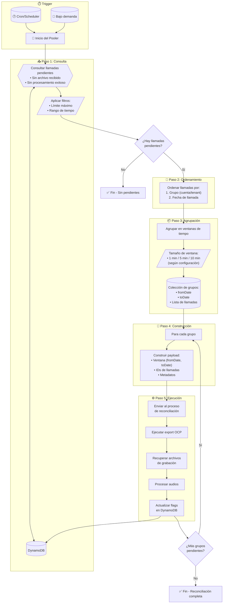

# Pooler de Reconciliación - Especificación Funcional

## Índice

1. [Resumen Ejecutivo](https://claude.ai/chat/552d76b7-e261-4624-833c-b094352f1595#1-resumen-ejecutivo)
2. [Contexto y Problema](https://claude.ai/chat/552d76b7-e261-4624-833c-b094352f1595#2-contexto-y-problema)
3. [Arquitectura General](https://claude.ai/chat/552d76b7-e261-4624-833c-b094352f1595#3-arquitectura-general)
4. [Modelo de Datos](https://claude.ai/chat/552d76b7-e261-4624-833c-b094352f1595#4-modelo-de-datos)
5. [Flujo de Procesamiento](https://claude.ai/chat/552d76b7-e261-4624-833c-b094352f1595#5-flujo-de-procesamiento)
6. [Detalle de Cada Paso](https://claude.ai/chat/552d76b7-e261-4624-833c-b094352f1595#6-detalle-de-cada-paso)
7. [Configuración del Sistema](https://claude.ai/chat/552d76b7-e261-4624-833c-b094352f1595#7-configuraci%C3%B3n-del-sistema)
8. [Manejo de Errores](https://claude.ai/chat/552d76b7-e261-4624-833c-b094352f1595#8-manejo-de-errores)
9. [Observabilidad y Métricas](https://claude.ai/chat/552d76b7-e261-4624-833c-b094352f1595#9-observabilidad-y-m%C3%A9tricas)
10. [Casos Borde y Consideraciones Especiales](https://claude.ai/chat/552d76b7-e261-4624-833c-b094352f1595#10-casos-borde-y-consideraciones-especiales)
11. [Seguridad](https://claude.ai/chat/552d76b7-e261-4624-833c-b094352f1595#11-seguridad)
12. [Escalabilidad](https://claude.ai/chat/552d76b7-e261-4624-833c-b094352f1595#12-escalabilidad)

---

## 1. Resumen Ejecutivo

### Objetivo

El **Pooler de Reconciliación** es un componente cuya responsabilidad es identificar llamadas cuyo archivo de grabación de voz aún no ha sido recibido o procesado exitosamente, agruparlas en ventanas de tiempo manejables y disparar su reprocesamiento a través del servicio de exportación de OCP.

### Alcance

|Aspecto|Descripción|
|---|---|
|**Entrada**|Registros de llamadas en DynamoDB con flags de estado|
|**Salida**|Payloads de reconciliación enviados al servicio de exportación OCP|
|**Frecuencia**|Periódica (cron) o bajo demanda|
|**Objetivo de negocio**|Garantizar que el 100% de las grabaciones sean eventualmente procesadas|

---

## 2. Contexto y Problema

### Problema que resuelve

En el flujo normal de procesamiento de llamadas, existen escenarios donde el archivo de grabación de voz no llega o no se procesa correctamente:

|Escenario|Causa típica|
|---|---|
|Archivo no recibido|Fallo de red, timeout en transferencia, error en OCP|
|Archivo recibido pero no procesado|Error en el procesador de audio, fallo de validación|
|Procesamiento parcial|Interrupción del servicio, error de almacenamiento|

### Necesidad del Pooler

Sin un mecanismo de reconciliación, estas llamadas quedarían en un estado "huérfano" indefinidamente. El pooler actúa como un mecanismo de **auto-sanación** del sistema.

### Integración con OCP

El servicio de exportación de OCP (Open Communication Platform) requiere consultas basadas en **rangos de tiempo**, no por llamadas individuales. Esto impone la necesidad de agrupar las llamadas pendientes en ventanas temporales antes de solicitar su reprocesamiento.

---

## 3. Arquitectura General

### Diagrama de Componentes

```
┌─────────────────────────────────────────────────────────────────────────┐
│                         POOLER DE RECONCILIACIÓN                        │
├─────────────────────────────────────────────────────────────────────────┤
│                                                                         │
│   ┌──────────┐    ┌──────────┐    ┌──────────┐    ┌──────────────────┐ │
│   │ Consulta │───▶│ Ordenar  │───▶│ Agrupar  │───▶│ Construir Payload│ │
│   │ DynamoDB │    │          │    │ Ventanas │    │                  │ │
│   └──────────┘    └──────────┘    └──────────┘    └────────┬─────────┘ │
│        ▲                                                    │          │
│        │                                                    ▼          │
│        │                                         ┌──────────────────┐  │
│        └─────────────────────────────────────────│  Reconciliador   │  │
│                     (actualiza flags)            └────────┬─────────┘  │
│                                                           │            │
└───────────────────────────────────────────────────────────┼────────────┘
                                                            │
                                                            ▼
                                                   ┌────────────────┐
                                                   │  Servicio OCP  │
                                                   │   (Externo)    │
                                                   └────────────────┘
```

### Componentes Involucrados

|Componente|Tipo|Responsabilidad|
|---|---|---|
|**Trigger**|EventBridge / Cron / API|Inicia la ejecución del pooler|
|**Pooler**|Lambda / ECS Task|Orquesta todo el proceso de reconciliación|
|**DynamoDB**|Base de datos|Almacena el estado de cada llamada|
|**Servicio OCP**|API Externa|Provee los archivos de grabación|
|**Reconciliador**|Lambda / Worker|Ejecuta el reprocesamiento real|

---

## 4. Modelo de Datos

### Estructura del Registro de Llamada en DynamoDB

Cada llamada almacenada en DynamoDB debe contener los siguientes atributos relevantes para la reconciliación:

#### Atributos de Identificación

|Atributo|Tipo|Descripción|Ejemplo|
|---|---|---|---|
|`callId`|String (PK)|Identificador único de la llamada|`"call-uuid-12345"`|
|`tenantId`|String (SK/GSI)|Identificador del tenant/cuenta|`"tenant-abc"`|
|`groupId`|String|Agrupación lógica (cuenta, cliente)|`"group-xyz"`|

#### Atributos Temporales

|Atributo|Tipo|Descripción|Ejemplo|
|---|---|---|---|
|`callTimestamp`|ISO 8601 String|Fecha y hora de la llamada|`"2024-01-15T10:30:00Z"`|
|`createdAt`|ISO 8601 String|Fecha de creación del registro|`"2024-01-15T10:31:00Z"`|
|`updatedAt`|ISO 8601 String|Última actualización|`"2024-01-15T10:35:00Z"`|

#### Flags de Estado (Críticos para Reconciliación)

|Atributo|Tipo|Valores|Descripción|
|---|---|---|---|
|`audioReceived`|Boolean|`true` / `false`|Indica si el archivo de audio fue recibido|
|`audioProcessed`|Boolean|`true` / `false`|Indica si el audio fue procesado exitosamente|
|`reconciliationStatus`|String|`pending` / `in_progress` / `completed` / `failed`|Estado del proceso de reconciliación|
|`reconciliationAttempts`|Number|0, 1, 2, ...|Número de intentos de reconciliación|
|`lastReconciliationAt`|ISO 8601 String|Fecha del último intento|`"2024-01-15T12:00:00Z"`|

#### Atributos de Metadata

|Atributo|Tipo|Descripción|
|---|---|---|
|`audioUrl`|String|URL del archivo de audio (si existe)|
|`duration`|Number|Duración de la llamada en segundos|
|`errorDetails`|Map|Detalles del último error (si aplica)|

### Índices Requeridos

Para que el pooler funcione eficientemente, se necesitan los siguientes índices:

#### GSI: ReconciliationIndex

|Partition Key|Sort Key|Proyección|
|---|---|---|
|`reconciliationStatus`|`callTimestamp`|ALL|

**Propósito**: Consultar eficientemente todas las llamadas pendientes de reconciliación ordenadas por fecha.

#### GSI: TenantCallsIndex

|Partition Key|Sort Key|Proyección|
|---|---|---|
|`tenantId`|`callTimestamp`|ALL|

**Propósito**: Consultar llamadas por tenant para agrupación.

---

## 5. Flujo de Procesamiento

### Diagrama de Flujo Completo



### Secuencia de Operaciones

```
Tiempo ──────────────────────────────────────────────────────────────▶

│ TRIGGER │    PASO 1    │  PASO 2  │   PASO 3   │ PASO 4 │   PASO 5   │
│         │              │          │            │        │            │
│  Cron   │   Query      │  Sort    │  Group     │ Build  │  Execute   │
│   or    │   DynamoDB   │  by      │  into      │ Pay-   │  Recon-    │
│  API    │   for        │  Group   │  Time      │ loads  │  ciliation │
│  Call   │   Pending    │  + Date  │  Windows   │        │            │
│         │              │          │            │        │            │
└─────────┴──────────────┴──────────┴────────────┴────────┴────────────┘
```

---

## 6. Detalle de Cada Paso

### Paso 1: Consulta de Llamadas Pendientes

#### Objetivo

Obtener de DynamoDB todas las llamadas que requieren reconciliación.

#### Criterios de Selección

Una llamada es candidata a reconciliación si cumple **cualquiera** de las siguientes condiciones:

|Condición|Lógica|
|---|---|
|Audio no recibido|`audioReceived = false`|
|Audio no procesado|`audioReceived = true AND audioProcessed = false`|
|Reconciliación fallida previa|`reconciliationStatus = 'failed' AND reconciliationAttempts < maxAttempts`|

#### Filtros Aplicables

|Filtro|Descripción|Valor por defecto|
|---|---|---|
|**Límite máximo**|Número máximo de llamadas a procesar en una ejecución|1000|
|**Rango de tiempo - Inicio**|No procesar llamadas más antiguas que X días|7 días|
|**Rango de tiempo - Fin**|No procesar llamadas más recientes que X minutos|5 minutos|
|**Excluir en progreso**|No incluir llamadas con `reconciliationStatus = 'in_progress'`|true|

#### Lógica del Rango de Tiempo

```
                    Ventana de Reconciliación
    ◄─────────────────────────────────────────────►
    
    │                                              │
    ▼                                              ▼
────┬──────────────────────────────────────────────┬─────────▶ tiempo
    │                                              │
 (now - 7d)                                    (now - 5min)
    
    Llamadas               Llamadas a              Llamadas
    muy antiguas           reconciliar             muy recientes
    (descartadas)                                  (esperando flujo normal)
```

**Razón del buffer de 5 minutos**: Las llamadas muy recientes aún pueden estar siendo procesadas por el flujo normal. Incluirlas causaría procesamiento duplicado.

#### Resultado del Paso 1

```
Lista<Llamada> llamadasPendientes = [
    { callId: "123", tenantId: "A", callTimestamp: "2024-01-15T10:00:00Z", ... },
    { callId: "456", tenantId: "A", callTimestamp: "2024-01-15T10:01:30Z", ... },
    { callId: "789", tenantId: "B", callTimestamp: "2024-01-15T09:55:00Z", ... },
    ...
]
```

---

### Paso 2: Ordenamiento de Resultados

#### Objetivo

Ordenar las llamadas para optimizar la agrupación posterior y el procesamiento en OCP.

#### Criterios de Ordenamiento

El ordenamiento se realiza en **dos niveles jerárquicos**:

|Nivel|Campo|Orden|Razón|
|---|---|---|---|
|**1º**|`groupId` (o `tenantId`)|Ascendente|Agrupa llamadas del mismo cliente/tenant|
|**2º**|`callTimestamp`|Ascendente|Facilita la creación de ventanas temporales consecutivas|

#### Ejemplo de Ordenamiento

**Antes del ordenamiento:**

```
callId: 789, tenantId: B, timestamp: 09:55:00
callId: 123, tenantId: A, timestamp: 10:00:00
callId: 456, tenantId: A, timestamp: 10:01:30
callId: 012, tenantId: B, timestamp: 10:05:00
```

**Después del ordenamiento:**

```
callId: 123, tenantId: A, timestamp: 10:00:00  ─┐
callId: 456, tenantId: A, timestamp: 10:01:30  ─┘ Grupo A

callId: 789, tenantId: B, timestamp: 09:55:00  ─┐
callId: 012, tenantId: B, timestamp: 10:05:00  ─┘ Grupo B
```

#### Importancia para OCP

El servicio de exportación de OCP funciona con parámetros `fromDate` y `toDate`. Al ordenar por grupo y luego por fecha:

1. Minimizamos el número de llamadas a OCP (una por grupo + ventana)
2. Cada ventana contiene llamadas relacionadas (mismo tenant)
3. Facilitamos el tracking y debugging

---

### Paso 3: Agrupación en Ventanas de Tiempo

#### Objetivo

Dividir las llamadas ordenadas en grupos pequeños basados en rangos de tiempo, respetando los límites de OCP.

#### Concepto de Ventana

Una **ventana de tiempo** es un rango `[fromDate, toDate]` que contiene todas las llamadas cuyo `callTimestamp` cae dentro de ese rango.

```
Ventana 1          Ventana 2          Ventana 3
[10:00 - 10:05]    [10:05 - 10:10]    [10:10 - 10:15]
     │                   │                  │
     ▼                   ▼                  ▼
  ┌─────┐            ┌─────┐            ┌─────┐
  │ 3   │            │ 5   │            │ 2   │  ← llamadas
  │calls│            │calls│            │calls│
  └─────┘            └─────┘            └─────┘
```

#### Tamaños de Ventana

|Tamaño|Uso recomendado|Consideraciones|
|---|---|---|
|**1 minuto**|Alta densidad de llamadas|Más llamadas a OCP, mayor granularidad|
|**5 minutos**|Densidad media (recomendado)|Balance entre eficiencia y granularidad|
|**10 minutos**|Baja densidad de llamadas|Menos llamadas a OCP, ventanas más grandes|

#### Algoritmo de Agrupación

1. **Inicializar** la primera ventana con el `callTimestamp` de la primera llamada
2. **Para cada llamada:**
    - Si `callTimestamp` está dentro de la ventana actual → agregar a la ventana
    - Si `callTimestamp` excede la ventana actual → cerrar ventana, crear nueva ventana
3. **Al cambiar de grupo/tenant:** cerrar ventana actual, crear nueva ventana

#### Selección Dinámica del Tamaño de Ventana

El tamaño de ventana puede calcularse dinámicamente según:

|Factor|Lógica|
|---|---|
|**Cantidad total de llamadas**|Si hay > 500 llamadas, usar ventanas más pequeñas (1 min)|
|**Límite de OCP**|Si OCP tiene límite de X llamadas por request, ajustar ventana|
|**Hora del día**|En horarios pico, usar ventanas más pequeñas|

**Fórmula sugerida:**

```
Si totalLlamadas > 500:
    tamañoVentana = 1 minuto
Si totalLlamadas > 100:
    tamañoVentana = 5 minutos
Si no:
    tamañoVentana = 10 minutos
```

#### Estructura de Salida

Cada grupo/ventana resultante contiene:

|Campo|Tipo|Descripción|
|---|---|---|
|`groupId`|String|Identificador del grupo (tenant)|
|`fromDate`|ISO 8601|Inicio de la ventana|
|`toDate`|ISO 8601|Fin de la ventana|
|`calls`|Array|Lista de llamadas en esta ventana|
|`callCount`|Number|Cantidad de llamadas en la ventana|

#### Ejemplo de Resultado

```
Grupos resultantes:
[
    {
        groupId: "tenant-A",
        fromDate: "2024-01-15T10:00:00Z",
        toDate: "2024-01-15T10:05:00Z",
        calls: [call-123, call-456, call-457],
        callCount: 3
    },
    {
        groupId: "tenant-A",
        fromDate: "2024-01-15T10:05:00Z",
        toDate: "2024-01-15T10:10:00Z",
        calls: [call-458, call-459],
        callCount: 2
    },
    {
        groupId: "tenant-B",
        fromDate: "2024-01-15T09:55:00Z",
        toDate: "2024-01-15T10:00:00Z",
        calls: [call-789],
        callCount: 1
    }
]
```

---

### Paso 4: Construcción del Payload de Reconciliación

#### Objetivo

Transformar cada grupo de ventana en un payload estructurado listo para enviar al reconciliador.

#### Estructura del Payload

```
ReconciliationPayload {
    // Identificación
    reconciliationId: String      // UUID único para tracking
    batchId: String               // ID del batch general (agrupa todos los payloads de esta ejecución)
    
    // Contexto
    groupId: String               // Tenant/cuenta
    windowIndex: Number           // Índice de esta ventana en el grupo
    totalWindows: Number          // Total de ventanas para este grupo
    
    // Ventana de tiempo
    fromDate: ISO 8601 String
    toDate: ISO 8601 String
    
    // Llamadas
    callIds: Array<String>        // Lista de IDs de llamadas a reconciliar
    callCount: Number
    
    // Metadata
    createdAt: ISO 8601 String    // Timestamp de creación del payload
    priority: String              // "high" | "normal" | "low"
    maxRetries: Number            // Reintentos permitidos para este payload
    
    // Configuración
    ocpEndpoint: String           // Endpoint de OCP a usar
    callbackUrl: String           // URL para notificar resultado (opcional)
}
```

#### Reglas de Construcción

|Campo|Regla de construcción|
|---|---|
|`reconciliationId`|Generar UUID v4 único|
|`batchId`|Mismo ID para todos los payloads de la misma ejecución del pooler|
|`priority`|Si `reconciliationAttempts > 2` → "high", si no → "normal"|
|`maxRetries`|`configMaxRetries - maxReconciliationAttempts` de las llamadas en el grupo|

#### Validaciones Pre-envío

Antes de enviar cada payload, validar:

|Validación|Acción si falla|
|---|---|
|`callIds` no está vacío|Descartar payload, loggear warning|
|`fromDate < toDate`|Corregir o descartar|
|Todas las llamadas pertenecen al mismo `groupId`|Separar en múltiples payloads|

---

### Paso 5: Ejecución del Proceso de Reconciliación

#### Objetivo

Procesar cada payload: llamar a OCP, obtener grabaciones, procesarlas y actualizar estado.

#### Sub-pasos de Ejecución

##### 5.1 Marcar llamadas como "en progreso"

Antes de iniciar el procesamiento:

|Acción|Campo|Valor|
|---|---|---|
|Actualizar en DynamoDB|`reconciliationStatus`|`"in_progress"`|
|Actualizar en DynamoDB|`lastReconciliationAt`|timestamp actual|
|Incrementar|`reconciliationAttempts`|+1|

**Propósito**: Evitar que otra ejecución del pooler tome las mismas llamadas.

##### 5.2 Llamar al servicio de exportación de OCP

|Parámetro|Valor|
|---|---|
|`fromDate`|`payload.fromDate`|
|`toDate`|`payload.toDate`|
|`tenantId`|`payload.groupId`|
|`format`|Configurado (ej: "wav", "mp3")|

**Respuesta esperada de OCP:**

```
{
    recordings: [
        { callId: "123", audioUrl: "https://...", duration: 120 },
        { callId: "456", audioUrl: "https://...", duration: 85 },
        ...
    ],
    notFound: ["789"],  // Llamadas sin grabación en OCP
    errors: []
}
```

##### 5.3 Recuperar archivos de grabación

Para cada `audioUrl` recibido:

1. Descargar el archivo de audio
2. Validar integridad (checksum si disponible)
3. Almacenar en el destino configurado (S3, filesystem, etc.)

##### 5.4 Procesar los audios

Ejecutar el pipeline de procesamiento de audio:

|Etapa|Descripción|
|---|---|
|Validación de formato|Verificar codec, sample rate, etc.|
|Transcripción|Si aplica, enviar a servicio de transcripción|
|Análisis|Si aplica, ejecutar análisis de sentimiento, etc.|
|Almacenamiento|Guardar resultados procesados|

##### 5.5 Actualizar flags en DynamoDB

**Caso: Procesamiento exitoso**

|Campo|Valor|
|---|---|
|`audioReceived`|`true`|
|`audioProcessed`|`true`|
|`reconciliationStatus`|`"completed"`|
|`audioUrl`|URL del audio almacenado|
|`updatedAt`|timestamp actual|

**Caso: Audio no encontrado en OCP**

|Campo|Valor|
|---|---|
|`reconciliationStatus`|`"failed"`|
|`errorDetails`|`{ code: "NOT_FOUND", message: "Audio not available in OCP" }`|

**Caso: Error en procesamiento**

|Campo|Valor|
|---|---|
|`reconciliationStatus`|`"failed"`|
|`errorDetails`|Detalles del error|

---

## 7. Configuración del Sistema

### Parámetros Configurables

#### Configuración de Consulta

|Parámetro|Tipo|Default|Descripción|
|---|---|---|---|
|`maxCallsPerExecution`|Number|1000|Límite de llamadas por ejecución|
|`lookbackDays`|Number|7|Días hacia atrás para buscar|
|`bufferMinutes`|Number|5|Minutos recientes a ignorar|
|`includeFailedReconciliations`|Boolean|true|Reintentar fallidas|
|`maxReconciliationAttempts`|Number|3|Máximo de reintentos por llamada|

#### Configuración de Ventanas

|Parámetro|Tipo|Default|Descripción|
|---|---|---|---|
|`defaultWindowSizeMinutes`|Number|5|Tamaño de ventana por defecto|
|`dynamicWindowSizing`|Boolean|true|Habilitar sizing dinámico|
|`minWindowSizeMinutes`|Number|1|Tamaño mínimo de ventana|
|`maxWindowSizeMinutes`|Number|15|Tamaño máximo de ventana|

#### Configuración de Ejecución

|Parámetro|Tipo|Default|Descripción|
|---|---|---|---|
|`parallelPayloads`|Number|5|Payloads a procesar en paralelo|
|`ocpTimeout`|Number|30000|Timeout para llamadas a OCP (ms)|
|`retryDelayMs`|Number|1000|Delay entre reintentos|
|`enableDryRun`|Boolean|false|Ejecutar sin procesar realmente|

#### Configuración del Scheduler

|Parámetro|Tipo|Default|Descripción|
|---|---|---|---|
|`cronExpression`|String|`"0 */15 * * * *"`|Cada 15 minutos|
|`enabled`|Boolean|true|Habilitar ejecución automática|
|`timezone`|String|`"UTC"`|Zona horaria del cron|

### Ejemplo de Configuración Completa

```yaml
reconciliationPooler:
  query:
    maxCallsPerExecution: 1000
    lookbackDays: 7
    bufferMinutes: 5
    includeFailedReconciliations: true
    maxReconciliationAttempts: 3
  
  windows:
    defaultWindowSizeMinutes: 5
    dynamicWindowSizing: true
    minWindowSizeMinutes: 1
    maxWindowSizeMinutes: 15
  
  execution:
    parallelPayloads: 5
    ocpTimeout: 30000
    retryDelayMs: 1000
    enableDryRun: false
  
  scheduler:
    cronExpression: "0 */15 * * * *"
    enabled: true
    timezone: "UTC"
  
  ocp:
    baseUrl: "https://ocp.example.com/api/v1"
    exportEndpoint: "/recordings/export"
    authType: "bearer"
```

---

## 8. Manejo de Errores

### Clasificación de Errores

|Tipo|Ejemplos|Acción|
|---|---|---|
|**Transitorios**|Timeout de red, OCP no disponible, throttling|Reintentar con backoff|
|**Permanentes**|Audio no existe en OCP, formato inválido|Marcar como fallido, no reintentar|
|**De configuración**|Credenciales inválidas, endpoint incorrecto|Alertar, detener ejecución|

### Estrategia de Reintentos

```
Intento 1: Inmediato
Intento 2: Esperar 1 segundo
Intento 3: Esperar 5 segundos
Intento 4: Esperar 30 segundos
Intento 5: Marcar como fallido definitivamente
```

### Manejo de Fallos Parciales

Cuando un payload contiene múltiples llamadas y algunas fallan:

|Escenario|Acción|
|---|---|
|100% éxito|Marcar todas como completadas|
|Fallo parcial|Marcar exitosas como completadas, fallidas como pendientes para siguiente ejecución|
|100% fallo|Reintentar todo el payload (si no excede intentos)|

### Circuit Breaker para OCP

Si OCP falla consistentemente:

|Condición|Acción|
|---|---|
|5 errores consecutivos|Abrir circuito, pausar 1 minuto|
|10 errores en 5 minutos|Abrir circuito, pausar 5 minutos|
|50% tasa de error en 10 minutos|Alertar, reducir paralelismo|

---

## 9. Observabilidad y Métricas

### Métricas a Capturar

#### Métricas de Volumen

|Métrica|Tipo|Descripción|
|---|---|---|
|`calls_pending_total`|Gauge|Llamadas pendientes de reconciliación|
|`calls_processed_total`|Counter|Llamadas procesadas (exitosas)|
|`calls_failed_total`|Counter|Llamadas con fallo de reconciliación|
|`payloads_sent_total`|Counter|Payloads enviados al reconciliador|

#### Métricas de Rendimiento

|Métrica|Tipo|Descripción|
|---|---|---|
|`execution_duration_seconds`|Histogram|Duración de cada ejecución del pooler|
|`ocp_latency_seconds`|Histogram|Latencia de llamadas a OCP|
|`processing_time_per_call_ms`|Histogram|Tiempo de procesamiento por llamada|

#### Métricas de Salud

|Métrica|Tipo|Descripción|
|---|---|---|
|`ocp_errors_total`|Counter|Errores de OCP por tipo|
|`circuit_breaker_state`|Gauge|Estado del circuit breaker (0=cerrado, 1=abierto)|
|`reconciliation_age_hours`|Histogram|Antigüedad de llamadas pendientes|

### Logs Estructurados

Cada ejecución debe loggear:

```json
{
  "level": "info",
  "event": "pooler_execution_completed",
  "batchId": "batch-uuid-123",
  "totalCallsFound": 150,
  "totalWindowsCreated": 12,
  "successfulCalls": 145,
  "failedCalls": 5,
  "durationMs": 45000,
  "timestamp": "2024-01-15T10:15:00Z"
}
```

### Alertas Recomendadas

|Alerta|Condición|Severidad|
|---|---|---|
|Alta acumulación|`calls_pending_total > 5000` por 1 hora|Warning|
|Fallo masivo|`calls_failed_total` incrementa > 100 en 15 min|Critical|
|OCP no disponible|`ocp_errors_total` > 10 en 5 min|Critical|
|Pooler no ejecuta|No hay ejecución en 30 minutos|Warning|

---

## 10. Casos Borde y Consideraciones Especiales

### Caso: Llamadas con timestamp futuro

**Situación**: Una llamada tiene `callTimestamp` en el futuro (error de reloj del sistema origen).

**Solución**:

- Filtrar llamadas con `callTimestamp > now` durante la consulta
- Loggear como anomalía para investigación
- No intentar reconciliar hasta que el timestamp sea válido

### Caso: Mismo callId en múltiples tenants

**Situación**: Por error de integración, el mismo `callId` existe para diferentes tenants.

**Solución**:

- La clave primaria debe ser compuesta: `tenantId#callId`
- Procesar como llamadas independientes
- Alertar sobre la duplicación para corrección en origen

### Caso: Ventana sin llamadas

**Situación**: Después de agrupar, una ventana queda vacía.

**Solución**:

- Descartar ventanas vacías antes del Paso 4
- No enviar payloads con `callIds` vacío

### Caso: OCP retorna más llamadas de las solicitadas

**Situación**: OCP retorna grabaciones que no estaban en nuestra lista de `callIds`.

**Solución**:

- Ignorar llamadas no solicitadas
- Loggear el exceso para análisis
- Solo procesar las llamadas que están en nuestro payload original

### Caso: Llamada reconciliada por flujo normal durante el proceso

**Situación**: Mientras el pooler procesa, el flujo normal completa la llamada.

**Solución**:

- Antes de actualizar a "completed", verificar estado actual
- Si ya está `audioProcessed = true`, no sobrescribir
- Usar actualización condicional en DynamoDB

### Caso: Ejecución del pooler interrumpida

**Situación**: Lambda timeout o fallo durante la ejecución.

**Solución**:

- Las llamadas marcadas como `in_progress` tendrán timeout configurable
- Siguiente ejecución: si `lastReconciliationAt > X minutos` y `status = in_progress` → resetear a `pending`

---

## 11. Seguridad

### Autenticación con OCP

|Método|Uso|
|---|---|
|API Key|Incluir en header `X-API-Key`|
|Bearer Token|Token JWT en header `Authorization`|
|mTLS|Certificado cliente para conexiones seguras|

### Protección de Datos

|Dato|Protección|
|---|---|
|Grabaciones de audio|Encriptar en tránsito (TLS) y reposo (AES-256)|
|URLs de audio|URLs pre-firmadas con expiración corta (15 min)|
|Logs|No loggear contenido de audio, solo metadatos|

### Permisos IAM (AWS)

```yaml
# Permisos mínimos requeridos
- dynamodb:Query
- dynamodb:UpdateItem
- dynamodb:GetItem
- s3:PutObject (para almacenar audios)
- s3:GetObject (para leer audios)
- logs:CreateLogGroup
- logs:CreateLogStream
- logs:PutLogEvents
```

---

## 12. Escalabilidad

### Estrategias de Escalado

#### Escalado Horizontal

|Componente|Estrategia|
|---|---|
|Pooler|Particionamiento por tenant (cada instancia maneja subset de tenants)|
|Reconciliador|Múltiples workers consumiendo de cola|
|DynamoDB|On-demand capacity o provisioned con auto-scaling|

#### Procesamiento en Paralelo

```
                          ┌─────────────┐
                       ┌─▶│ Worker 1    │
                       │  └─────────────┘
┌────────┐  ┌───────┐  │  ┌─────────────┐
│ Pooler │─▶│ Queue │──┼─▶│ Worker 2    │
└────────┘  └───────┘  │  └─────────────┘
                       │  ┌─────────────┐
                       └─▶│ Worker 3    │
                          └─────────────┘
```

### Límites y Throttling

|Recurso|Límite recomendado|Razón|
|---|---|---|
|Llamadas a OCP por minuto|100|Evitar throttling de OCP|
|Payloads en paralelo|5-10|Balance CPU/memoria|
|Llamadas por payload|100|Manejo de errores más granular|
|Ejecuciones simultáneas del pooler|1|Evitar procesamiento duplicado|

### Particionamiento por Tenant

Para sistemas con muchos tenants:

```
Pooler Instancia 1: Tenants A-M
Pooler Instancia 2: Tenants N-Z

Cada instancia consulta solo sus tenants asignados.
```

---

## Anexos

### A. Glosario

|Término|Definición|
|---|---|
|**Pooler**|Componente que consulta y agrupa llamadas pendientes|
|**Reconciliación**|Proceso de recuperar y procesar grabaciones faltantes|
|**OCP**|Open Communication Platform - sistema externo de grabaciones|
|**Ventana de tiempo**|Rango temporal para agrupar llamadas|
|**Payload**|Estructura de datos enviada al reconciliador|

### B. Checklist de Implementación

- [ ] Crear tabla DynamoDB con índices requeridos
- [ ] Configurar GSI para consultas de reconciliación
- [ ] Implementar lógica de consulta con filtros
- [ ] Implementar ordenamiento multi-nivel
- [ ] Implementar agrupación en ventanas
- [ ] Implementar construcción de payloads
- [ ] Integrar con servicio OCP
- [ ] Implementar actualización de flags
- [ ] Configurar scheduler (EventBridge/CloudWatch)
- [ ] Implementar métricas y logging
- [ ] Configurar alertas
- [ ] Pruebas de carga
- [ ] Documentar runbook operacional

### C. Referencias

- Documentación de API de OCP
- Guía de mejores prácticas de DynamoDB
- Patrones de integración empresarial

---

_Documento generado para especificación funcional. Versión 1.0_